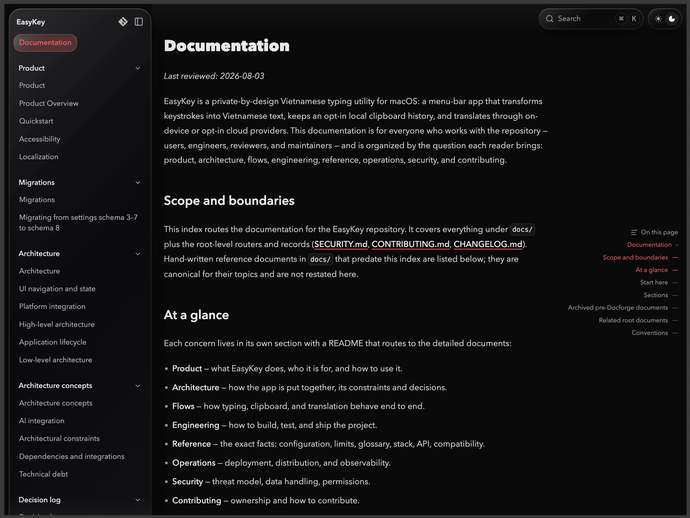
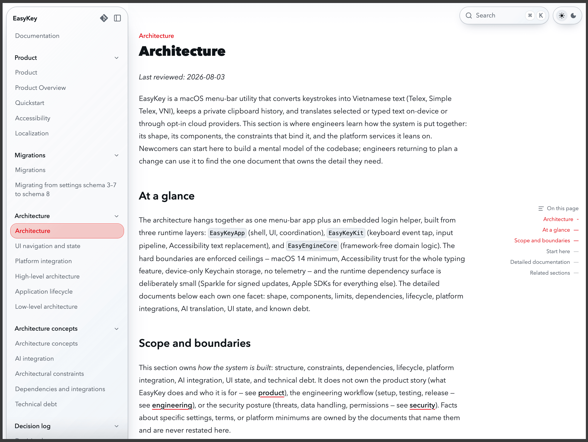

<div align="center">
  

  <h1>DOCFORGE</h1>

  <p><code>[ insert repository :: generate documentation :: no invented lore ]</code></p>

  [](.claude-plugin/plugin.json)
  [](https://agentskills.io)
  [](LICENSE)
</div>

<br/>

An Agent Skill that writes documentation grounded in the actual source — code
graphs, manifests, git history. Every claim carries provenance; every
document is audited before it counts.

```text
PRECHECK → ANALYZE → PLAN → WRITE → AUDIT → TRACK
```

<br/>

### ▸ install

```sh
npx skills add jonaskahn/docforge       # this project
npx skills add jonaskahn/docforge -g -y # every project
```

Claude Code native marketplace:

```text
/plugin marketplace add jonaskahn/docforge
/plugin install docforge@docforge
```

Either path installs [`skills/docforge`](skills/docforge/SKILL.md) — the
required core. `docforge-revise` and `docforge-dashboard` below are thin
entrypoints on top of it.

<br/>

### ▸ skills

Plain language works — *"Document this repository from scratch"*,
*"Check which docs have drifted"*. Or call a skill directly:

**`/docforge`** — fresh start. Intake asks scope in two short turns (goal,
layout, and target readers — Human, AI coding agents, or Both — then tier,
profiles, and audience), summarizes, and waits for your confirm before
writing anything.

| | |
|---|---|
| `/docforge` | intake → plan → write |
| `/docforge --plan-only` | plan / dry-run only, nothing written |

**`/docforge-revise`** — keep it current. Re-grounds what drifted; a bare
run only syncs manifest metadata, no questions asked.

| | |
|---|---|
| `/docforge-revise` | sync manifest only |
| `/docforge-revise all` | full-tree structural refresh |
| `/docforge-revise <area>` | scoped refresh, e.g. `architecture`, `reference`, `agents` |
| `/docforge-revise flow` | flow harvest → organize → derive → write |
| `/docforge-revise flow --plan-only` | flow analysis only, no body writes |

**`/docforge-dashboard`** — liquid docs. Serves the written tree as a local
Fumadocs site.

| | |
|---|---|
| `/docforge-dashboard` | reconcile → rebuild if changed → serve → open |
| `/docforge-dashboard --plan-only` | preflight + route plan, no build |
| `/docforge-dashboard export` | static export to `<dashboard>/out/` |
| `/docforge-dashboard status` | read-only: signatures, server state, doc count |
| `/docforge-dashboard stop` | stop the detached dev server |

**flags**, any skill — `--plan-only` dry-run · `--auto-accept` skip routine
pauses · `--no-dashboard` skip the auto dashboard step · `--help` full
reference in [`help.md`](skills/docforge/_shared/help.md).

<br/>

### ▸ demo

<p align="center">
  
  
</p>

<br/>

### ▸ requirements

a compatible AI coding agent · `git` · Python 3.10+ **or** Node.js 22+ / Bun
/ Deno · Node.js 22+ and `npm` for the dashboard only

Details: [workflows](skills/docforge/_shared/workflows/README.md) ·
[document contracts](skills/docforge/_shared/content/README.md) ·
[provenance model](skills/docforge/_shared/references/provenance-tracking.md)

<br/>

---

<div align="center">

Created by [Jonas Kahn](https://github.com/jonaskahn) · MIT ·
[issues](https://github.com/jonaskahn/docforge/issues) ·
[pull requests](https://github.com/jonaskahn/docforge/pulls)

</div>
