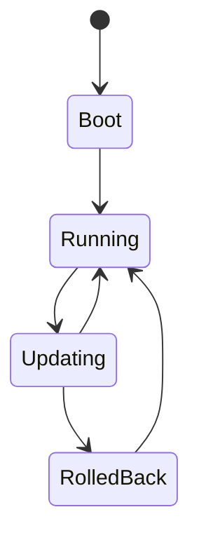

---
docforge_provenance:
  schema: "2.0"
  doc_id: "<DOC_ID>"
  path: "<DOCUMENT_PATH>"
  generated_at: "<GENERATED_AT>"
  generator:
    name: "docforge"
    version: "2.6.0"
  tier: "<TIER>"
  target_depth: "<TARGET_DEPTH>"
  graph:
    provider: "<GRAPH_PROVIDER>"
    flow: "<FLOW_CAPABILITY>"
  sections: []
---
# Firmware lifecycle

_Last reviewed: {{YYYY-MM-DD}}_

## {{State}}

**Behavior:** {{what happens in this state}}

**On failed update:** {{roll back / brick / retry — stated plainly}}

Hardware inventory: see [hardware-map.md](hardware-map.md).
