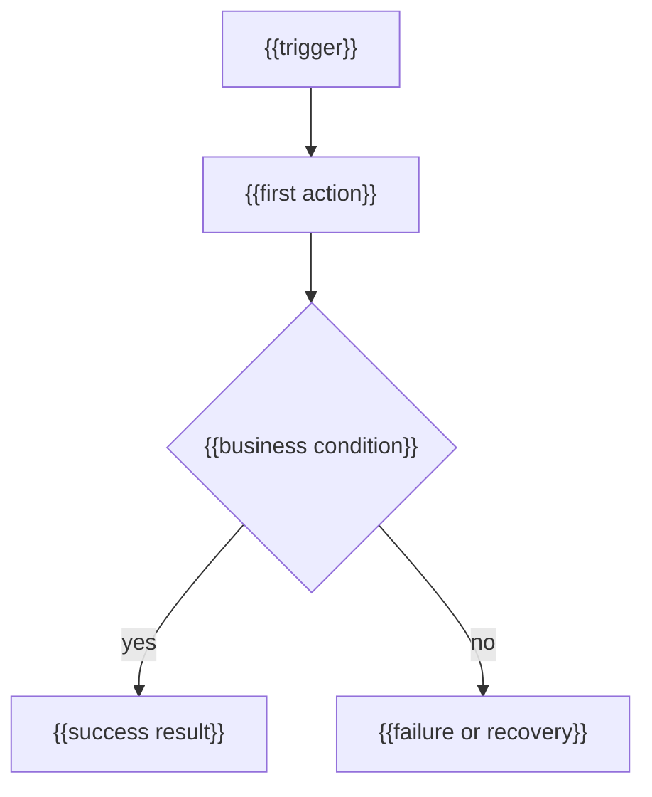

---
docforge_provenance:
  schema: "2.0"
  doc_id: "<DOC_ID>"
  path: "<DOCUMENT_PATH>"
  generated_at: "<GENERATED_AT>"
  generator:
    name: "docforge"
    version: "2.5.0"
  tier: "<TIER>"
  target_depth: "<TARGET_DEPTH>"
  graph:
    provider: "<GRAPH_PROVIDER>"
    flow: "<FLOW_CAPABILITY>"
  sections: []
---
# Process flows

_Last reviewed: {{YYYY-MM-DD}}_

The business process as actually executed by the system — business-language steps a domain expert recognizes, not the technical call graph. Source it from the selected flow graph; decision points link to `business-rules.md` rather than restating the condition.

### Flow: {{business name, e.g. "Order approval"}}

1. {{step, in business language}} — enforced in {{the `<module>` by path, not a private symbol}}
2. {{step}} — enforced in {{the `<module>` by path}}
3. {{...}}

{{One sentence: which branch a reader must understand before changing the flow.}}

**Decision points:** {{where the flow branches, and on what business condition}} — see [business-rules.md](./business-rules.md#{{rule-slug}})

<!-- Repeat per flow. One `sections` entry per flow, id matching its heading anchor. -->
