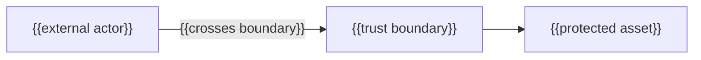

---
docforge_provenance:
  schema: "2.0"
  doc_id: "<DOC_ID>"
  path: "<DOCUMENT_PATH>"
  generated_at: "<GENERATED_AT>"
  generator:
    name: "docforge"
    version: "2.6.0"
  tier: "<TIER>"
  target_depth: "<TARGET_DEPTH>"
  graph:
    provider: "<GRAPH_PROVIDER>"
    flow: "<FLOW_CAPABILITY>"
  sections: []
---
# Threat model

_Last reviewed: {{YYYY-MM-DD}}_

## Assets and trust boundaries

{{What each boundary separates, and why the asset behind it matters.}}

## Threats

### {{Asset or boundary}} — {{STRIDE category}}

**Threat:** {{what an attacker could do here}}

**Response:** {{mitigate | eliminate | transfer | accept}} — {{the testable control}}

## Accepted residual risk

{{Risks knowingly left unmitigated, and why — this section is the signal
that analysis was performed.}}

Data classifications: see [data-handling.md](data-handling.md). Disclosure
process: see [security-policy.md](security-policy.md).
