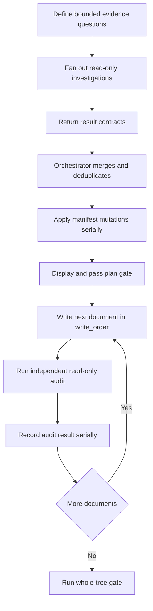

# Parallel execution

Parallel work is read-only evidence collection. The orchestrator owns planning,
merging, document writes, and state transitions.

## Safe fan-out

Fan out only across scopes that can be investigated independently:

- functional areas with separate evidence questions;
- distinct flow candidates;
- child repositories;
- independent audits of completed artifacts.

Workers must not edit repository files. In particular, only the orchestrator
mutates `.docforge/manifest.json`: manifest commands perform unlocked full-file
rewrites, so concurrent writers can silently lose state.

Read-only discovery may run before the plan gate. No document writing starts
until the complete tree and document cards pass that gate. Afterward, document
writing follows `write_order` one document at a time. Manifest initialization,
dynamic additions, status changes, provenance synchronization, and audit
recording are also serial orchestrator operations.

## Result contract

Each worker returns one bounded result containing:

- assigned scope and evidence question;
- candidate documents or flows, when applicable;
- claims with source paths, symbols or regions, and graph references;
- confidence, unresolved gaps, and conflicting evidence;
- proposed manifest changes, without applying them;
- audit verdict and defects for audit work.

Results must distinguish observed evidence from synthesis. A worker that cannot
answer its question returns the gap and the retrieval step reached; it does not
expand into an unbounded repository scan.

## Merge and deduplication

The orchestrator normalizes and merges results before any mutation. Deduplicate
source evidence by repository-relative path plus symbol or region, flow
candidates by normalized `entry_ref`, child repositories by canonical root,
and document proposals by manifest id and path. Combine corroborating evidence
without duplicating claims.

Do not silently collapse disagreements. Prefer current direct source over
summaries, record stale graph evidence as stale, and retain unresolved
conflicts for targeted follow-up. Apply the merged manifest proposal once,
redisplay any required structure update, then continue serial execution.
