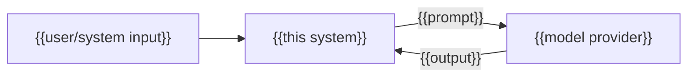

---
docforge_provenance:
  schema: "2.1"
  doc_id: "<DOC_ID>"
  path: "<DOCUMENT_PATH>"
  generated_at: "<GENERATED_AT>"
  generator:
    name: "docforge"
    version: "2.16.0"
  tier: "<TIER>"
  target_depth: "<TARGET_DEPTH>"
  graph:
    provider: "<GRAPH_PROVIDER>"
    flow: "<FLOW_CAPABILITY>"
  sections: []
---
# AI integration

_Last reviewed: {{YYYY-MM-DD}}_

## Prompt/input surface

{{What reaches the model, and sanitization/scoping before it does.}}

## Output handling

**Used as:** {{shown directly / drives an action / advisory only}}

## Safety and evaluation

**Safety controls:** {{content filtering, guardrails, human-in-the-loop gates
— or `none`.}}

**Evaluation evidence:** {{how this integration's behavior was tested before
shipping — eval suite, red-team pass, manual review — or `unknown`.}}

## Failure and fallback

{{Behavior when the provider is unavailable or returns low confidence.}}

## Privacy boundary

{{Does user data leave the system in the prompt? Is it retained by the provider?}}

Model quality claims (if this repo trains/fine-tunes the model): see
[model-card.md](model-card.md).
