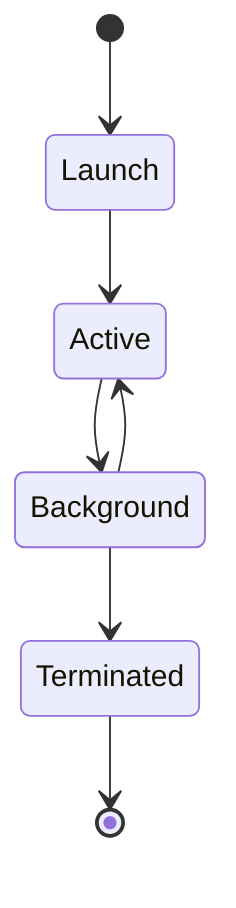

# Application lifecycle

_Last reviewed: {{YYYY-MM-DD}}_

_Repeat per state — Launch, Active, Background, Terminated above._

## {{State}}

**Owner:** {{accountable component or team for this state's behavior}}

**Trigger:** {{what enters this state}}

**Must do before leaving:** {{cleanup/save}}

**Restoration on relaunch:** {{behavior}}

**On kill mid-transition:** {{failure boundary}}
