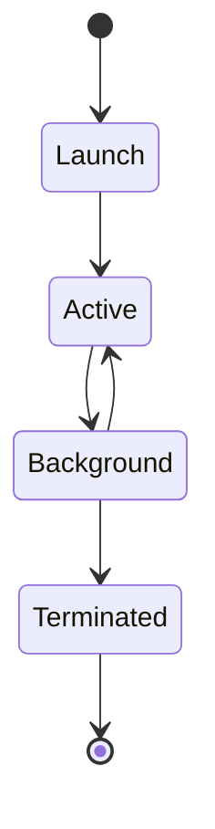

---
docforge_provenance:
  schema: "2.1"
  doc_id: "<DOC_ID>"
  path: "<DOCUMENT_PATH>"
  generated_at: "<GENERATED_AT>"
  generator:
    name: "docforge"
    version: "2.15.0"
  tier: "<TIER>"
  target_depth: "<TARGET_DEPTH>"
  graph:
    provider: "<GRAPH_PROVIDER>"
    flow: "<FLOW_CAPABILITY>"
  sections: []
---
# Application lifecycle

_Last reviewed: {{YYYY-MM-DD}}_

_Repeat per state — Launch, Active, Background, Terminated above._

## {{State}}

**Owner:** {{accountable component or team for this state's behavior}}

**Trigger:** {{what enters this state}}

**Must do before leaving:** {{cleanup/save}}

**Restoration on relaunch:** {{behavior}}

**On kill mid-transition:** {{failure boundary}}
