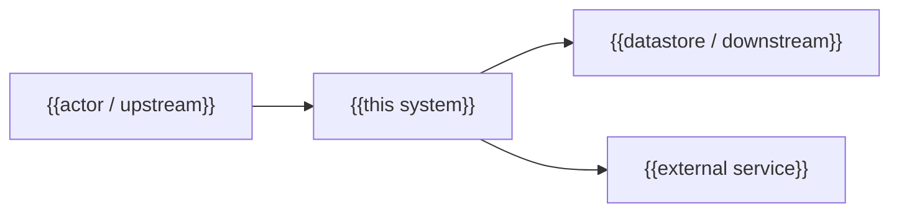

---
docforge_provenance:
  schema: "2.0"
  doc_id: "<DOC_ID>"
  path: "<DOCUMENT_PATH>"
  generated_at: "<GENERATED_AT>"
  generator:
    name: "docforge"
    version: "2.8.0"
  tier: "<TIER>"
  target_depth: "<TARGET_DEPTH>"
  graph:
    provider: "<GRAPH_PROVIDER>"
    flow: "<FLOW_CAPABILITY>"
  sections: []
---
# High-level architecture

_Last reviewed: {{YYYY-MM-DD}}_

{{One paragraph: what this system is, at the highest level of abstraction, and the
business capability it owns.}}

## System in context

{{Where this system sits in the wider landscape — who calls it, what it calls, which
external services and systems it borders. The "part of a business" view: name the
neighbours and the contracts between them, not the internals.}}

{{One sentence: what crosses each boundary and why the relationship matters.}}

## Containers and blackboxes

The major parts and what each is responsible for. One or two sentences each — behaviour,
not code. Deep mechanism lives in [low-level.md](low-level.md) and
[concepts/](concepts/README.md).

| Block | Responsibility | Technology | External interface | Boundary it owns |
|---|---|---|---|---|
| {{block}} | {{active responsibility}} | {{stack or unknown}} | {{protocol/channel}} | {{trust / API / data boundary, if any}} |

## Relationship matrix

| Origin | Destination | Action | Protocol / channel |
|---|---|---|---|
| {{block}} | {{block or external actor}} | {{specific active verb}} | {{evidenced protocol or unknown}} |

## Boundaries and invariants

{{State stable boundary and invariant facts. A relationship must have a
one-sentence rationale. For detailed flow, link
[data-flow.md](data-flow.md) rather than repeating it.}}

## Stable by design

{{This document changes once or twice a year. If a claim here would be falsified by a
routine refactor, it is written too close to the code — move that detail to low-level.md.}}

## Why it is like this

Rationale lives in [decisions/](decisions/README.md). Known shortcuts live in
[tech-debt.md](tech-debt.md). Hard limits live in [constraints.md](constraints.md).
