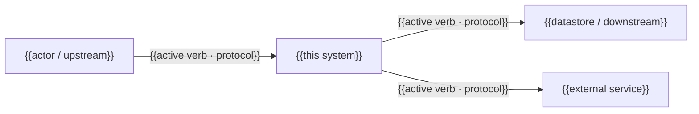
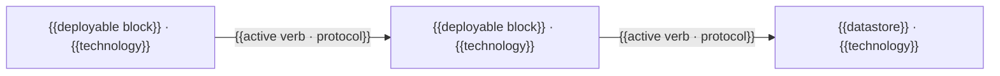

# High-level architecture

_Last reviewed: {{YYYY-MM-DD}}_

<!-- L0 — the answer. A reader who stops here must be able to state the
capability this system owns. See ../../../references/progressive-disclosure.md. -->

**In one sentence:** {{the business capability this system owns, stated before any structure}}

{{One paragraph: what this system is, at the highest level of abstraction, and the
business capability it owns.}}

## System in context

<!-- L1 — the shape. Name the neighbours; explain none of them. -->

_C4 context view: this system as one box among the actors and services around it —
name the neighbors and the contracts between them, never the internals._

{{Where this system sits in the wider landscape — who calls it, what it calls, which
external services and systems it borders. The "part of a business" view: name the
neighbours and the contracts between them, not the internals.}}

{{One or two sentences: what crosses each boundary and why the relationship
matters. This prose is not optional — a reader whose renderer drops the diagram,
and every screen-reader user, gets only this.}}

## Containers and blackboxes

<!-- L1 — still the shape. -->

_C4 container view: the deployable pieces inside that one box — never mix this zoom
level with the context diagram above. Detail that does not belong at this altitude
goes to low-level.md, never into this view; see
../../../references/progressive-disclosure.md rule 3._

The major parts and what each is responsible for. One or two sentences each — behaviour,
not code. Deep mechanism lives in [low-level.md](low-level.md) and
[concepts/](concepts/README.md). For `infrastructure-platform` repos, a "block" reads
as a provisioned resource or environment (a VPC, a managed database, a compute pool),
not application code.

_One row per block that matters for orientation, not every deployable unit. Technology
cites [reference/tech-stack.md](../reference/tech-stack.md); an unproven choice is
`unknown`, never inferred._

| Block | Responsibility | Technology | External interface | Boundary it owns | Decomposed in |
|---|---|---|---|---|---|
| {{block}} | {{active responsibility}} | {{stack or unknown}} | {{protocol/channel}} | {{trust / API / data boundary, if any}} | [low-level.md](low-level.md#{{whitebox-anchor}}) or `—` |

The table carries technology, interface, and boundary per block; the diagram
carries what a table cannot — which block talks to which, in which direction.
Both earn their place, and neither substitutes for the other.

{{One or two sentences: which communication paths matter and why, and which
block's absence would stop the system. If this view outgrows its budget, split
it by functional area — never drop it.}}

## Relationship matrix

<!-- L2 — per-edge detail. -->

_One row per material edge between blocks, or between a block and an external actor —
directional, one specific active verb._

| Origin | Destination | Action | Protocol / channel |
|---|---|---|---|
| {{block}} | {{block or external actor}} | {{specific active verb}} | {{evidenced protocol or unknown}} |

## Boundaries and invariants

<!-- L2 — per-boundary detail. -->

{{State stable boundary and invariant facts. A relationship must have a
one-sentence rationale. For detailed flow, link
[data-flow.md](data-flow.md) rather than repeating it.}}

## Stable by design

<!-- L3 — the boundary. -->

{{This document changes once or twice a year. If a claim here would be falsified by a
routine refactor, it is written too close to the code — move that detail to low-level.md.}}

## Why it is like this

{{One short paragraph: which forces shaped this shape — the constraint, the
scale it was built for, the integration it had to live with. Name the force and
link the record that settled it; never restate a decision record's argument
here. Delete this paragraph when the repository evidences no such force, and
keep the routing lines below.}}

Rationale lives in [decisions/](decisions/README.md). Known shortcuts live in
[tech-debt.md](tech-debt.md). Hard limits live in [constraints.md](constraints.md).
