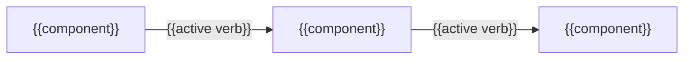
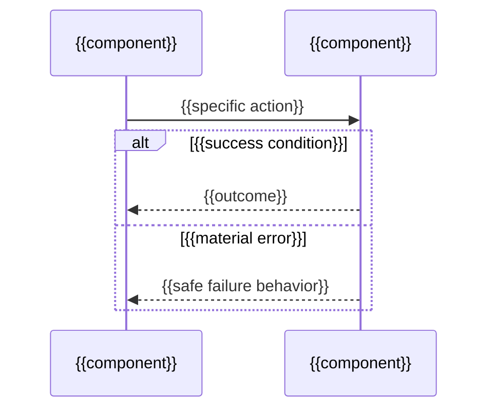
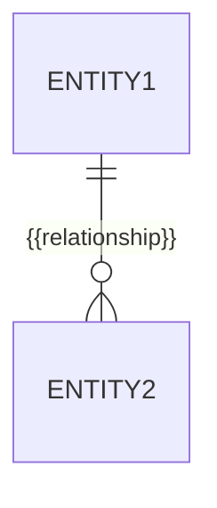

# Low-level architecture

_Last reviewed: {{YYYY-MM-DD}}_

<!-- L0 — the answer. See ../../../references/progressive-disclosure.md. -->

Component-level decomposition. Zooms into named blocks in
[high-level.md](high-level.md). It never becomes a Level-4 code or class document.

**This decomposition exists to support:** {{the decisions, reviews, or diagnoses a reader comes here to make}}

## Layout

<!-- L1 — the shape. -->


```text docforge-role=structure
{{repository}}/
├── {{source directory}}/    {{one-line responsibility}}
├── {{service directory}}/   {{one-line responsibility}}
└── {{test directory}}/      {{one-line responsibility}}
```

{{One sentence: what the grouping reveals about ownership or runtime boundaries.}}

## Selected whiteboxes

<!-- L1 — still the shape: name every block worth decomposing before explaining
any component below. -->

_Repeat per high-level block worth a component-level decomposition — not every block
named in high-level.md needs one._

### {{High-level parent block}}

**Motivation for decomposition:** {{what decision, review, diagnosis, or risk judgment this decomposition enables.}}

**Allowed dependency direction:** {{direction and rationale.}}



{{One or two sentences: what the grouping reveals about responsibility, and
which dependency the direction above deliberately forbids. Omit this diagram
only when the whitebox holds fewer than three components.}}

## Components

<!-- L2 — per-item detail begins here. -->

_Repeat per component inside this whitebox — the ones material to the decomposition's
motivation above, not an exhaustive file listing._

### {{Component name}}

**Responsibility:** {{what it does and the boundary it owns.}}

**Technology:** {{library/framework}}

**Public contract:** `{{signature or protocol}}`

- **Talks to:** -> {{component}} — {{specific active verb and protocol when evidenced}}
- **Owns:** {{the data or responsibility that is exclusively its}}
- **Invariant:** {{what is deliberately absent or always enforced — the fact a reader
  cannot recover by reading code, because it is the absence of something}}
- **Failure boundary:** {{what this component contains when it fails — the error or
  exception a caller must handle, and what happens to in-flight state on the way out}}
- **Key paths:** `{{stable file/module path(s) that orient implementation work}}`

## Runtime scenario

_Repeat per architecturally relevant scenario — **one to three**, never one per
code path. Document the important, surprising, risky, or volatile paths and
leave the routine ones out._

_Choose from these four areas rather than from whatever the graph surfaced
first: (a) an important use case or feature — how do the blocks execute it;
(b) an interaction at a critical external interface; (c) operation and
administration — launch, start-up, shutdown; (d) an error or exception
scenario. Keep each one schematic: every message maps to a named component
above, and detail that belongs to a component's own write-up stays there._

### {{Architecturally relevant intra-block path}}

{{Why this scenario matters and its successful outcome. Every message maps to a named component above.}}



{{One or two sentences restating the order and the failure branch in prose, so
the scenario survives without the diagram.}}

## Quality and change scenarios

{{The load, latency, or volume ceiling this decomposition was built to hold, and
the modification it was shaped to absorb cheaply — each stated as a scenario:
a stimulus, the component that responds, and the evidenced measure or the effort
the change costs. Evidence only: a configured limit, a benchmark, a load test,
an extension point the code actually exposes. Delete this whole section when the
repository evidences neither a quality ceiling nor a change the design
anticipates; never estimate a throughput figure.}}

## Data model

{{The main entities and how they relate, described. Not a schema dump — a routine column
rename must not falsify this. Link the generated schema if one exists.}}



{{One or two sentences: which relationship constrains the components above, and
which entity owns the write path.}}

## Significant subsystems

The ones worth a full deep-dive get their own folder under
[concepts/](concepts/README.md):

| Subsystem | Deep-dive |
|---|---|
| {{name}} | [concepts/{{slug}}/](concepts/{{slug}}/README.md) |

## Cross-cutting concerns

<!-- L3 — the boundary: where each concern is owned, not how it works. -->

_Rows below are the common cross-cutting concerns. Delete a row when the concern
does not apply to this system. When it plainly should apply but the evidence
shows no path, write "no evidenced path found" rather than deleting the row —
a silently missing row reads as "handled", and hedging exactly where the
evidence stops is the honest signal. Never fill a cell with `unknown`._

| Concern | Where it lives | Notes |
|---|---|---|
| Configuration | `{{path}}` | See [../reference/configuration.md](../reference/configuration.md) |
| Error handling | `{{path}}` | |
| Logging | `{{path}}` | |
| Authentication | `{{path}}` | |
| Persistence | `{{path}}` | |
