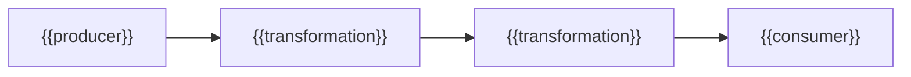

---
docforge_provenance:
  schema: "2.1"
  doc_id: "<DOC_ID>"
  path: "<DOCUMENT_PATH>"
  generated_at: "<GENERATED_AT>"
  generator:
    name: "docforge"
    version: "2.16.0"
  tier: "<TIER>"
  target_depth: "<TARGET_DEPTH>"
  graph:
    provider: "<GRAPH_PROVIDER>"
    flow: "<FLOW_CAPABILITY>"
  sections: []
---
# Data flow

_Last reviewed: {{YYYY-MM-DD}}_

_Repeat the `##` lineage block below per independent pipeline — trace one lineage
per section, not one all-in-one diagram of everything that touches the data._

## {{Lineage name, e.g. Order event pipeline}}

{{One paragraph: what crosses each arrow and why it matters.}}

### Producer: {{name}}

{{What it emits, and the contract it guarantees about the output.}}

### {{Transformation name}}

**Guarantees:** {{schema / ordering / completeness the next stage can rely on.}}

**Checks:** {{validation performed before the guarantee is trusted — a schema
check, a row-count assertion, a checksum — or `none`.}}

Schema owned by: [data-types.md](data-types.md#{{anchor}})

### Consumer: {{name}}

{{What it expects, and what it does with the data.}}

## Failure and recovery

- **{{Transient failure}}.** {{What retries, delays, and acknowledgement do.}}
- **{{Permanent failure}}.** {{What is recorded and when retry stops.}}
- **{{Recovery}}.** {{How stale work is recovered, replayed, or escalated.}}

> **Related:** {{Existing generated flow, runbook, or reference documents; delete when none exist.}}
