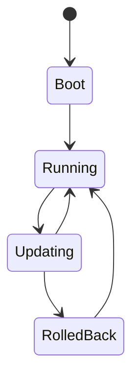

# Firmware lifecycle

_Last reviewed: {{YYYY-MM-DD}}_

**Runs on:** {{board/MCU and the peripherals this firmware directly drives —
the concrete hardware this document covers, not a generic embedded overview.
Full inventory: [hardware-map.md](hardware-map.md).}}

**Protocols:** {{what talks to what, over which bus or interface.}}

_Repeat per state — Boot, Running, Updating, RolledBack above._

## {{State}}

**Behavior:** {{what happens in this state}}

**On failed update:** {{roll back / brick / retry — stated plainly}}

## Memory and power

{{Flash/RAM budget available, and which power states gate which transitions —
a constraint the lifecycle above must respect, not a datasheet reproduction.}}

Hardware inventory: see [hardware-map.md](hardware-map.md).
