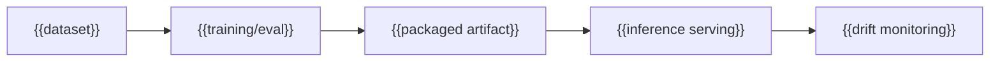

---
docforge_provenance:
  schema: "2.1"
  doc_id: "<DOC_ID>"
  path: "<DOCUMENT_PATH>"
  generated_at: "<GENERATED_AT>"
  generator:
    name: "docforge"
    version: "2.16.0"
  tier: "<TIER>"
  target_depth: "<TARGET_DEPTH>"
  graph:
    provider: "<GRAPH_PROVIDER>"
    flow: "<FLOW_CAPABILITY>"
  sections: []
---
# Model lifecycle

_Last reviewed: {{YYYY-MM-DD}}_

## Dataset lineage

**Source:** {{where the data came from}}

**Excludes:** {{known gaps}}

**Known biases:** {{if evaluated}}

## Training and artifact

{{Training run → artifact provenance, so a production behavior traces back
to a specific configuration.}}

## Inference serving

{{How the artifact is served — batch or online, latency/throughput envelope,
and how a serving version maps back to a specific artifact.}}

## Limitations

{{Concise, evidenced deployment limitations — known failure modes, unsupported
inputs, or conditions under which the output should not be trusted. Detailed
evaluation numbers live in [model-card.md](model-card.md); this is the short,
deployment-facing version.}}

## Drift monitoring

**Signal watched:** {{metric}}

**On drift:** {{retrain / roll back / alert-only}}

**Owner:** {{who acts on it}}

Evaluation results and intended use: see [model-card.md](model-card.md).
