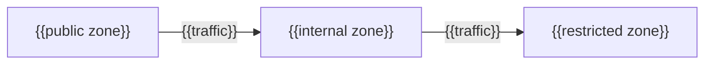

# Network

_Last reviewed: {{YYYY-MM-DD}}_

_Repeat per boundary crossing — the ones that matter for trust-zone segmentation,
not every open port._

## {{Boundary crossing}}

**Traffic:** {{what crosses}} · **Purpose:** {{why}}

**Enforcement:** {{security group / network policy / firewall rule set}}

**If removed:** {{concentration-risk consequence}}
