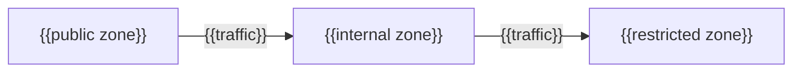

---
docforge_provenance:
  schema: "2.1"
  doc_id: "<DOC_ID>"
  path: "<DOCUMENT_PATH>"
  generated_at: "<GENERATED_AT>"
  generator:
    name: "docforge"
    version: "2.15.0"
  tier: "<TIER>"
  target_depth: "<TARGET_DEPTH>"
  graph:
    provider: "<GRAPH_PROVIDER>"
    flow: "<FLOW_CAPABILITY>"
  sections: []
---
# Network

_Last reviewed: {{YYYY-MM-DD}}_

_Repeat per boundary crossing — the ones that matter for trust-zone segmentation,
not every open port._

## {{Boundary crossing}}

**Traffic:** {{what crosses}} · **Purpose:** {{why}}

**Enforcement:** {{security group / network policy / firewall rule set}}

**If removed:** {{concentration-risk consequence}}
