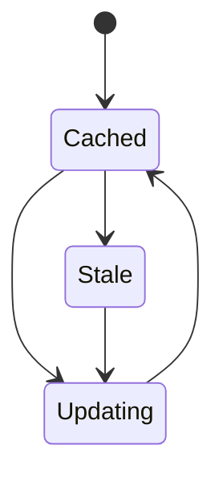

# Offline and installation

_Last reviewed: {{YYYY-MM-DD}}_

**Installability criteria:** {{what makes this installable}}

**Cache contents:** {{what's cached}}

**Update trigger:** {{when the cache refreshes — periodic, on-deploy, on-demand}}

**Invalidation:** {{how stale cache is detected/cleared}}

## Offline boundary

_One row per feature; leave a cell blank where a category doesn't apply._

| Works offline | Degrades | Fails |
|---|---|---|
| {{feature}} | {{feature}} | {{feature}} |

**On reconnect:** {{recovery behavior}}
