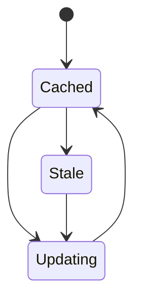

---
docforge_provenance:
  schema: "2.0"
  doc_id: "<DOC_ID>"
  path: "<DOCUMENT_PATH>"
  generated_at: "<GENERATED_AT>"
  generator:
    name: "docforge"
    version: "2.7.0"
  tier: "<TIER>"
  target_depth: "<TARGET_DEPTH>"
  graph:
    provider: "<GRAPH_PROVIDER>"
    flow: "<FLOW_CAPABILITY>"
  sections: []
---
# Offline and installation

_Last reviewed: {{YYYY-MM-DD}}_

**Installability criteria:** {{what makes this installable}}

**Cache contents:** {{what's cached}}

**Invalidation:** {{how stale cache is detected/cleared}}

## Offline boundary

| Works offline | Degrades | Fails |
|---|---|---|
| {{feature}} | {{feature}} | {{feature}} |

**On reconnect:** {{recovery behavior}}
