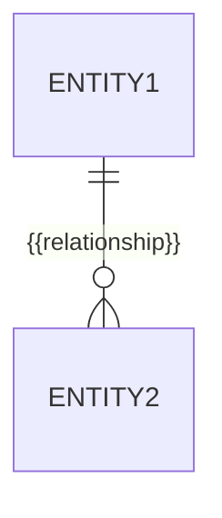

---
docforge_provenance:
  schema: "2.0"
  doc_id: "<DOC_ID>"
  path: "<DOCUMENT_PATH>"
  generated_at: "<GENERATED_AT>"
  generator:
    name: "docforge"
    version: "2.6.1"
  tier: "<TIER>"
  target_depth: "<TARGET_DEPTH>"
  graph:
    provider: "<GRAPH_PROVIDER>"
    flow: "<FLOW_CAPABILITY>"
  sections: []
---
# Persistence

_Last reviewed: {{YYYY-MM-DD}}_

## {{Entity}}

**Storage:** {{table/collection}} · **Key:** {{strategy}}

**Denormalization:** {{if any, and why}}

## Migrations

**Mechanism:** {{tool}} · **Reversible:** {{yes/no}}

## Transaction and consistency boundary

{{What's atomic together; consistency model where it isn't (eventual /
read-your-writes / none).}}

## Failure recovery

{{What happens to a write in flight during a crash.}}
