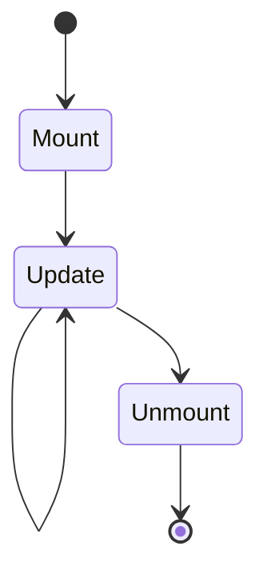

# Rendering

_Last reviewed: {{YYYY-MM-DD}}_

**Renders where:** {{server / client / server-then-client handoff}}

_Repeat per stage — Mount, Update, Unmount above._

## {{Lifecycle stage}}

**Trigger:** {{what causes this transition}}

**Behavior:** {{what happens}}

**Loading/error presentation:** {{what the user sees while pending, and on
a render-boundary failure}}

**On render failure:** {{recovery — retry, fallback UI, error boundary
escalation}}

State ownership: see [state.md](state.md). Component catalog: see
[ui-components.md](ui-components.md).
