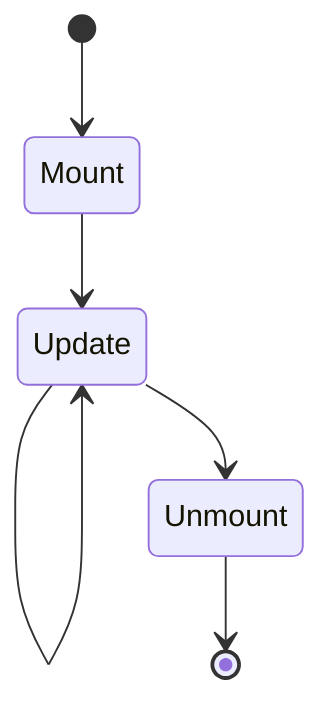

---
docforge_provenance:
  schema: "2.0"
  doc_id: "<DOC_ID>"
  path: "<DOCUMENT_PATH>"
  generated_at: "<GENERATED_AT>"
  generator:
    name: "docforge"
    version: "2.8.0"
  tier: "<TIER>"
  target_depth: "<TARGET_DEPTH>"
  graph:
    provider: "<GRAPH_PROVIDER>"
    flow: "<FLOW_CAPABILITY>"
  sections: []
---
# Rendering

_Last reviewed: {{YYYY-MM-DD}}_

## {{Lifecycle stage}}

**Trigger:** {{what causes this transition}}

**Behavior:** {{what happens}}

State ownership: see [state.md](state.md). Component catalog: see
[ui-components.md](ui-components.md).
