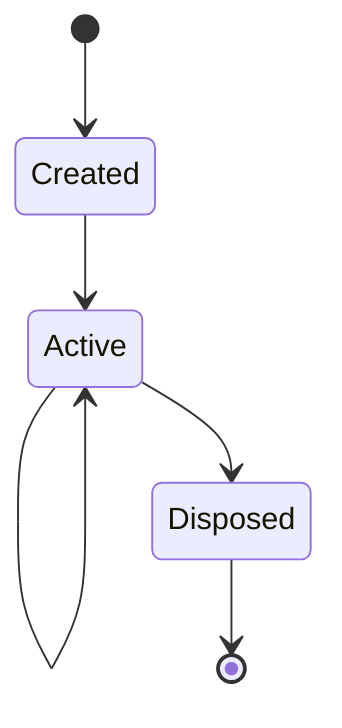

---
docforge_provenance:
  schema: "2.1"
  doc_id: "<DOC_ID>"
  path: "<DOCUMENT_PATH>"
  generated_at: "<GENERATED_AT>"
  generator:
    name: "docforge"
    version: "2.8.0"
  tier: "<TIER>"
  target_depth: "<TARGET_DEPTH>"
  graph:
    provider: "<GRAPH_PROVIDER>"
    flow: "<FLOW_CAPABILITY>"
  sections: []
---
# State management

_Last reviewed: {{YYYY-MM-DD}}_

_Repeat the `##` block below per state domain — not per instance of a
state's value._

## {{State domain}}

**Owner:** {{who mutates this}}

**Read by:** {{consumers}}

**Synchronization:** {{how concurrent readers/writers stay consistent, or
`single-writer, no conflict possible`}}

**Cache invalidation:** {{what clears a stale copy, or `not cached`}}

**On bad transition:** {{failure/recovery behavior}}

Render lifecycle: see [rendering.md](rendering.md).
