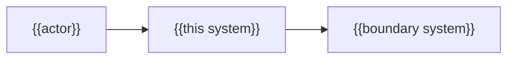

---
docforge_provenance:
  schema: "2.0"
  doc_id: "<DOC_ID>"
  path: "<DOCUMENT_PATH>"
  generated_at: "<GENERATED_AT>"
  generator:
    name: "docforge"
    version: "2.8.0"
  tier: "<TIER>"
  target_depth: "<TARGET_DEPTH>"
  graph:
    provider: "<GRAPH_PROVIDER>"
    flow: "<FLOW_CAPABILITY>"
  sections: []
---
# System overview

_Last reviewed: {{YYYY-MM-DD}}_

{{One paragraph: the handful of major capabilities and how they hang together — the
system as one box among the actors and boundary systems around it, not its internals.}}



## Primary end-to-end path

{{Pick the single journey that crosses the most capabilities — the one a newcomer
should trace first, not just the simplest one.}}

```mermaid
sequenceDiagram
  participant Actor as {{actor}}
  participant Sys as {{subsystem}}
  participant Ext as {{external}}
  Actor->>Sys: {{request}}
  Sys->>Ext: {{call}}
  Ext-->>Sys: {{response}}
  Sys-->>Actor: {{outcome}}
```

## Feature → owning flow → subsystem

_One row per major capability — enough for a newcomer to find their way, not the
full feature list. Every row must resolve to an existing flow document; an
unresolved owner is labeled `unknown`, never left implicit._

| Capability | Owning flow | Implementing subsystem |
|---|---|---|
| {{capability}} | [{{flow}}](../flows/README.md) | {{subsystem}} |

Link out to [`docs/flows/README.md`](../flows/README.md) for the full matrix;
do not duplicate its rows.
