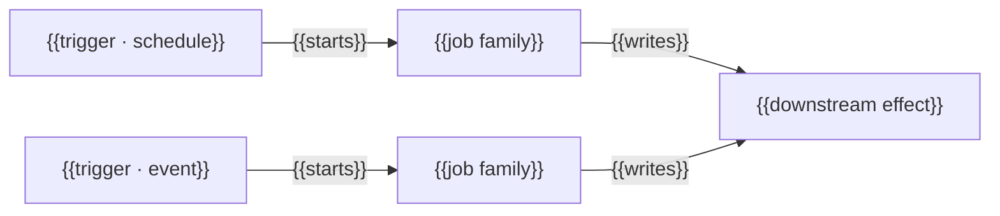

# Triggers and jobs

_Last reviewed: {{YYYY-MM-DD}}_

{{One paragraph: what kinds of work run in the background here, and what a
reader is usually trying to find out — why work did or did not run.}}

{{One or two sentences: which trigger fires most often, and which job's failure
is most visible. The per-job detail below is the reference; this view is the map.}}

_Repeat per job or trigger — the `##` block below._

## {{Job name}}

**Trigger:** {{schedule / event / manual}}

**Payload:** {{shape}}

**Concurrency:** {{overlapping instances allowed? what happens if so}}

**Downstream effect:** {{what happens once it completes}}

**Owner:** {{team or role}}

Reliability detail (retry, idempotency, dead-letter): see
[job-reliability.md](job-reliability.md).
