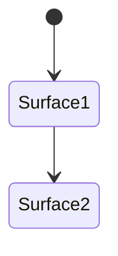

---
docforge_provenance:
  schema: "2.1"
  doc_id: "<DOC_ID>"
  path: "<DOCUMENT_PATH>"
  generated_at: "<GENERATED_AT>"
  generator:
    name: "docforge"
    version: "2.15.0"
  tier: "<TIER>"
  target_depth: "<TARGET_DEPTH>"
  graph:
    provider: "<GRAPH_PROVIDER>"
    flow: "<FLOW_CAPABILITY>"
  sections: []
---
# UI navigation and state

_Last reviewed: {{YYYY-MM-DD}}_

_Repeat the `##` block below per surface._

## {{Surface, e.g. Main navigation stack}}

**State owner:** {{global store / local component / platform navigation stack}}

**Allowed transitions:** {{which surfaces this one can navigate to or from}}

**Survives transition:** {{what persists, what resets}}

**Restoration on process death:** {{behavior}}

**Error presentation:** {{what the user sees}}
