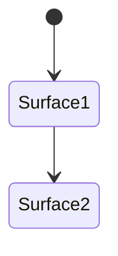

# UI navigation and state

_Last reviewed: {{YYYY-MM-DD}}_

_Repeat the `##` block below per surface._

## {{Surface, e.g. Main navigation stack}}

**State owner:** {{global store / local component / platform navigation stack}}

**Allowed transitions:** {{which surfaces this one can navigate to or from}}

**Survives transition:** {{what persists, what resets}}

**Restoration on process death:** {{behavior}}

**Error presentation:** {{what the user sees}}
