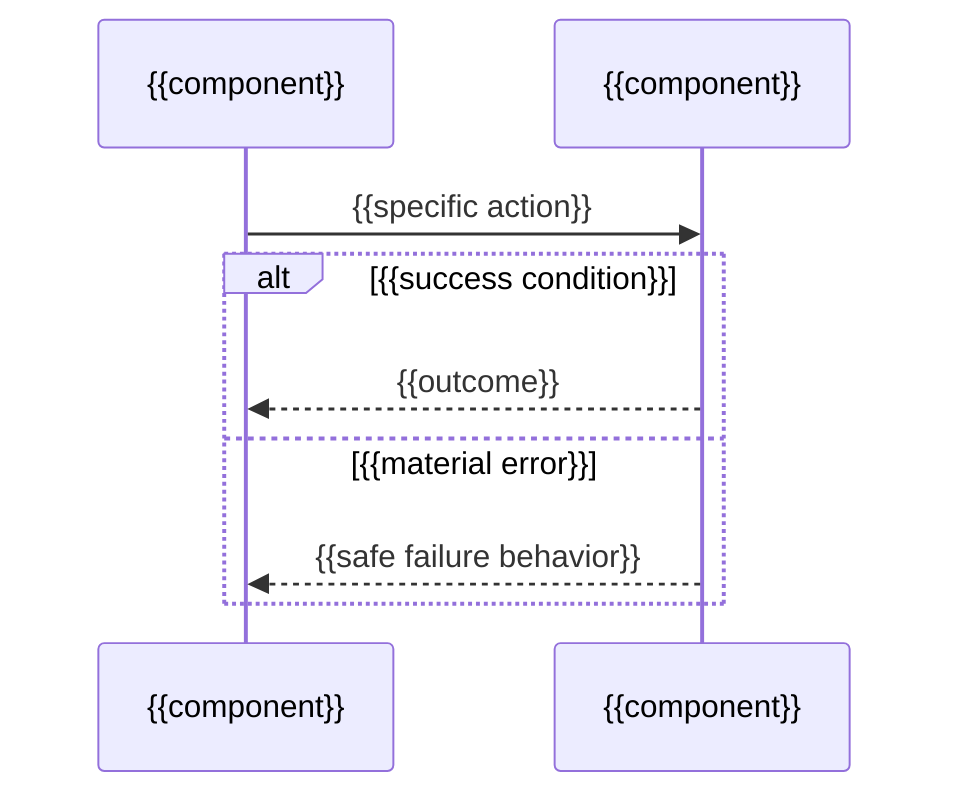

# {{TITLE}}

_Last reviewed: {{YYYY-MM-DD}}_

{{Two or three sentences introducing the compact architecture section: what
this file covers, why the architecture section exists, and who should read
it. A reader with no prior project knowledge should understand how the system
is shaped and what question this file answers.}}

## At a glance

{{The system mental model: the handful of major components and how they fit
together, in one or two sentences or a short list. Establish the shape; the
high-level section below owns the detail.}}

## Scope and boundaries

{{What belongs in the architecture section, and what is owned by an adjacent
section instead. Name the neighbouring sections so a reader who landed here
by mistake can route themselves away. Do not restate a fact another section
owns.}}

## High-level architecture

{{Structure, boundaries, and integration surfaces — grounded in repository
evidence. Do not invent architecture the source does not show.}}

## Component design

_Diligence and higher only — omit this section entirely at Spine._

{{Selected whitebox decompositions under the high-level blocks above — the
ones worth a component-level zoom, not every block. For each: responsibility,
technology, public contract, directional relationships, and the invariant or
failure boundary a caller must handle. Do not duplicate the high-level map;
add depth only where it changes a reader's judgment.}}

{{One architecturally relevant intra-block runtime scenario: why it matters,
its successful outcome, and its error path. Every message above maps to a
named component.}}

## Constraints

_Diligence and higher only — omit this section entirely at Spine._

| Constraint | Limit | Source | Why it exists | What lifting it would take |
|---|---|---|---|---|
| {{e.g. throughput}} | {{the ceiling}} | {{platform limit, regulation, contract, physics}} | {{the design choice behind it}} | {{the change required}} |

{{Boundaries this system assumes about its environment and inputs, and
non-goals — what it deliberately does not do, and which component does it
instead. Keep temporary shortcuts and user-visible limitations out; those
belong in Technical debt below and in `reference.md`, not here.}}

## Dependencies

_Diligence and higher only — omit this section entirely at Spine._

| Package | Purpose | Criticality | If it disappeared |
|---|---|---|---|
| {{name}} | {{why it is here}} | {{high/medium/low}} | {{replacement path and effort}} |

{{External services this system integrates with directly — purpose,
criticality, and failure handling for each. Summarize development
dependencies rather than enumerating them.}}

## Technical debt

_Diligence and higher only — omit this section entirely at Spine._

| Item | Shortcut taken | Cost it imposes | Remediation |
|---|---|---|---|
| {{name}} | {{the shortcut, in mechanism terms}} | {{who pays, how, when}} | {{what fixing it takes}} |

{{Describe each shortcut's cost in behavioral terms, with evidence — do not
paste the offending code. Keep hard constraints out; those belong in
Constraints above.}}
