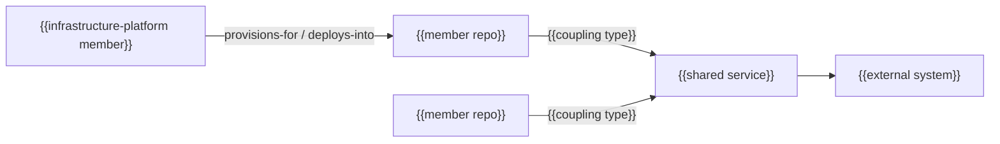

# {{TITLE}}

_Last reviewed: {{YYYY-MM-DD}}_

{{Two or three sentences introducing the compact portfolio section: what
this file covers, why the portfolio layer exists, and who should read it. A
reader with no prior project knowledge should understand what repositories
are in scope and how they relate.}}

## At a glance

{{The portfolio mental model: the member repositories and how they fit
together, in one or two sentences or a short list. Establish the shape; the
sections below own the detail.}}

## Scope and boundaries

{{What belongs in this portfolio layer, and what is owned by a member
repository's own documentation instead. Cross-repository decisions and epics
are discovered dynamically and indexed separately at
[docs-portfolio/decisions/](docs-portfolio/decisions/README.md) and
[docs-portfolio/epics/](docs-portfolio/epics/README.md) — link there rather
than folding their content in here.}}

## Repository inventory

_Last generated: {{YYYY-MM-DD}}_

| Repo | Path | Membership | Docforge status (before this review) | Backfilled this review? |
|---|---|---|---|---|
| {{repo name}} | {{path relative to portfolio root}} | {{declared (submodule) / detected — not in .gitmodules / parent}} | {{none / Spine / Diligence / Portfolio}} | {{yes — selected tier / no}} |

{{One row per member of the collection, including the parent. Never omit a
detected-but-excluded repo from this table — record it as excluded and why,
rather than leaving no trace it was considered.}}

## System context

{{One paragraph: what the portfolio borders and how members relate.}}

| Trigger | Repos involved | Outcome | Owning flow |
|---|---|---|---|
| {{trigger}} | {{repos}} | {{outcome}} | {{link to owning repo's flow doc}} |

| Repo | Depends on | Coupling type | Resolution |
|---|---|---|---|
| {{repo}} | {{sibling repo}} | {{shared library / API contract / event schema / provisions-for / deploys-into}} | {{mapping / heuristic}} |

## Security posture

| Control | Repos covered | Repos not covered |
|---|---|---|
| {{control}} | {{repos}} | {{repos, or "none"}} |

{{One entry per shared dependency: what it is, which repos rely on it, and
the blast radius across the portfolio if it fails. A gap that exists because
no single member repo owns it — link the owning member's own
threat-model.md or equivalent for local detail; do not duplicate it here.}}

## Operations

| Dependency | Repos relying on it | Blast radius if it degrades |
|---|---|---|
| {{queue / datastore / on-call rotation}} | {{repos}} | {{portfolio-wide consequence}} |

{{An operational gap that exists because no single member repo owns it —
link the owning member's own observability.md/deployment.md for local
detail; do not duplicate it here.}}

## Diligence index

### {{Area, e.g. Architecture}}

| Claim | Evidence | Confidence | Gap / follow-up |
|---|---|---|---|
| {{claim}} | {{evidence found}} | {{confirmed / partial / unsupported}} | {{what's missing, if any}} |

## Glossary

{{Terms shared across member repositories, or likely to confuse a reader
moving between them. Repo-local terms belong in that repo's own glossary.}}

| Term | Definition | Clearest member-repo source |
|---|---|---|
| {{term}} | {{precise definition}} | {{link}} |
