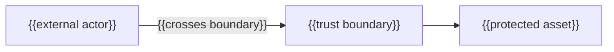

# {{TITLE}}

_Last reviewed: {{YYYY-MM-DD}}_

{{Two or three sentences introducing the compact security section: what this
file covers, why the security section exists, and who should read it. A
reader with no prior project knowledge should understand what is protected
and from what.}}

## At a glance

{{The security mental model: the main assets, trust boundaries, and data
classes, in one or two sentences or a short list. Establish the shape; the
sections below own the detail.}}

## Scope and boundaries

{{What belongs in the security section, and what is owned by an adjacent
section instead. Name the neighbouring sections so a reader who landed here
by mistake can route themselves away. Never include disclosure workflow or
credentials here.}}

## Threat model

{{What each boundary separates, and why the asset behind it matters.}}

| DFD element type | S | T | R | I | D | E |
|---|---|---|---|---|---|---|
| External entity | ✓ | N/A | ✓ | N/A | N/A | N/A |
| Process | ✓ | ✓ | ✓ | ✓ | ✓ | ✓ |
| Data store | N/A | ✓ | ✓ | ✓ | ✓ | N/A |
| Data flow | N/A | ✓ | N/A | ✓ | ✓ | N/A |

Use `N/A`, `examined-none-found`, or a threat ID in every applicable cell.

| Element | Type | S | T | R | I | D | E |
|---|---|---|---|---|---|---|---|
| {{element}} | {{entity/process/store/flow}} | {{value}} | {{value}} | {{value}} | {{value}} | {{value}} | {{value}} |

### {{Asset or boundary}} — {{STRIDE category}}

**Threat:** {{what an attacker could do here}}

**Disposition:** {{mitigate | eliminate | transfer | accept}} — {{the
testable control and safe evidence}}

**Residual uncertainty:** {{what remains, or why evidence is incomplete}}

**Accepted residual risk:** {{list accepted risks only with rationale,
review condition, established owner, and decision link.
`None accepted based on available evidence` is valid.}}

## Data handling

### {{Data class, e.g. Regulated / PII}}

| Stage | Behavior |
|---|---|
| Collected | {{source and mechanism}} |
| Used | {{where and for what}} |
| Retained | {{duration and reason}} |
| Deleted | {{mechanism, not policy language}} |

**Access:** {{who or what can read this class}}

{{Compliance evidence: only what the repository actually evidences — no
invented posture claim.}}
