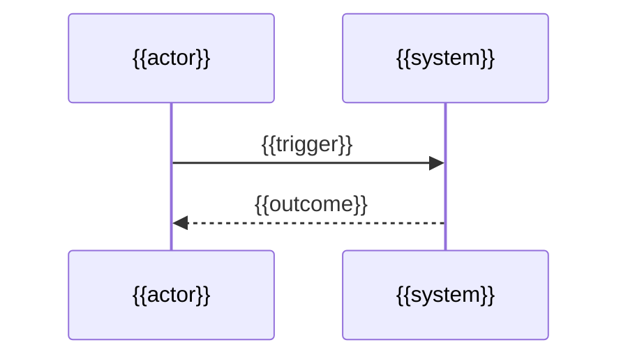

# {{Flow name}}

_Last reviewed: {{YYYY-MM-DD}}_

<!-- L0 — the answer. A reader who stops after the next two blocks must be able
to state correctly what this flow produces. See
../../references/progressive-disclosure.md. -->

{{Open with what this flow produces and who depends on it. Add a sentence for
each thing a reader must hold before step 1 — and stop there; the sections
below own the detail.}}

**Guarantee:** {{the durable state change or response a caller can rely on when
this flow succeeds — the same fact ## Outcome states in full, stated here so a
reader who stops at the top is still correct}}

## Trigger and actors

<!-- L1 — the shape. Name every participant; explain none of them. -->

**Trigger:** {{event, request, or schedule — name the kind: user action, upstream event/message, scheduled job, or direct call}}

**Preconditions:** {{state, permission, or prior flow that must already hold, or "none"}}

**Initiated by:** {{the human or system that starts it}}

**Visible participants:** {{actors the initiator can observe — the surfaces it gets responses from}}

**Behind the scenes:** {{actors the initiator never sees — queues, workers, stores, third parties}}

**Data in play:** {{what the flow reads and what it durably writes. Delete this line when the evidence shows no durable read or write.}}

**Timing and limits:** {{evidenced timeouts, retry counts, batch sizes, rate limits, or schedule cadence. Evidence only — delete this line rather than estimate one.}}

## Happy path

<!-- L1 — still the shape. Name each step; do not explain a branch or a failure
here. Those are L2, below, beside the step that creates them. -->

### {{Milestone}}

{{Group steps under milestone sub-headings only once the happy path passes
about six steps; a milestone is a point at which the work is durably further
along. Under six steps, delete these sub-headings and number the steps flat.}}

1. {{observable action}}
2. {{observable action}}
3. {{outcome}}

<!-- The flow's primary diagram, and an L1 obligation: it carries the happy path
only. Default: sequenceDiagram. Switch to a flowchart when the reader's primary
question is "what are the branches and where do they go", or to a journey for
felt experience — one primary form, not two of the same shape. A second diagram
answering a *different* question is welcome: the trigger-to-outcome fan-out
under ## Outcome below. See ../../references/illustration.md. -->



## Branches and rules

<!-- L2 — per-item detail begins here. -->

{{Order branches by how often the trigger actually takes them, most common first.
No branches: state "No branches — every trigger reaches the same outcome" and
delete the block below.}}

### {{Branch name — the condition in plain language}}

**Branches from step:** {{happy-path step number}}

**Condition:** {{the decision, stated as precisely as the code enforces it — never more precisely}}

**Then:** {{what happens instead, or link the owning rule document; never restate a rule owned elsewhere}}

**Rejoins at:** {{a happy-path step, a different outcome, or "ends the flow"}}

{{Repeat this block per branch.}}

**Other rules:** {{A business rule that constrains this flow without creating a branch — one line, linked to its owning document if it governs 3+ flows, or "none beyond the branches above."}}

## Failure and recovery

{{Order failure modes by how often they occur or by blast radius, most severe
first. Evidence only — an error path, retry/backoff config, dead-letter queue,
or monitor; never invent a failure mode.

Cover each category the evidence supports and delete the ones it does not: a
decision this flow makes and rejects; an external event it waits for that does
not arrive as expected; a response that never comes within its timeout; an
interruption while a step is running; a cancellation that can arrive at almost
any point. A technical retry the caller never observes is mechanism, not a
failure mode — record it under **Immediate response**, never as its own entry.}}

### {{Failure mode — what goes wrong, in plain language}}

**Category:** {{decision point / awaited external event / timeout / interruption during a step / system-wide cancellation}}

**Detected by:** {{exception, timeout, monitor, or check that surfaces it}}

**Immediate response:** {{retry with backoff, idempotent replay, circuit-break, fail fast, or queue for later}}

**State left behind:** {{what is partially applied, queued, or quarantined, and whether repeating the step is safe}}

**Recovery:** {{compensating action, requeue, or manual replay — and what performs it}}

**Escalation boundary:** {{when this hands off to a runbook, operator, or another flow — link it}}

{{Repeat this block per evidenced failure mode.}}

## Observability

{{How an operator confirms this flow ran and finished: the log line, metric,
trace span, queue depth, or table row that shows it, and what a healthy value
looks like. Name the signal; the runbook owns what to do about it. Delete this
whole section when the evidence shows no such signal — never describe logging
the repository does not have.}}

## Outcome

<!-- L3 — the boundary. The guarantee stated at the top, now in full, plus what
this document hands off. -->

**On success:** {{durable state change, response, or side effect the caller can rely on}}

**On safe failure:** {{what remains guaranteed true even when the flow does not complete}}

**Deferred work:** {{what continues asynchronously after this flow returns, or "none"}}

{{When the flow has two or more terminal outcomes and the reader's question is
only "what does this trigger lead to, in order" — no second-level branch, no
per-step actor — render them as one ASCII fan-out, the second diagram form
illustration.md blesses for a different question than the primary diagram
above; otherwise delete this block. Follow the fence with a sentence stating
that a single trigger fans out to these outcomes and nothing branches further.}}

```text
{{trigger event}}
├─ {{condition A}} ──> {{step}} ──> {{outcome A}}
└─ {{condition B}} ──> {{step}} ──> {{outcome B}}
```

## Why it works this way

{{The constraint, decision, or history that shaped this flow — a pinned version,
a platform limit, a comment explaining a workaround, a migration in the history.
Link the decision record when one exists and write no more than one sentence
naming the force it settled. Delete this whole section when the repository shows
no such reason; never reconstruct intent.}}

> **Related:** {{Existing generated documents that own adjacent behavior; delete this footer when none exist.}}
