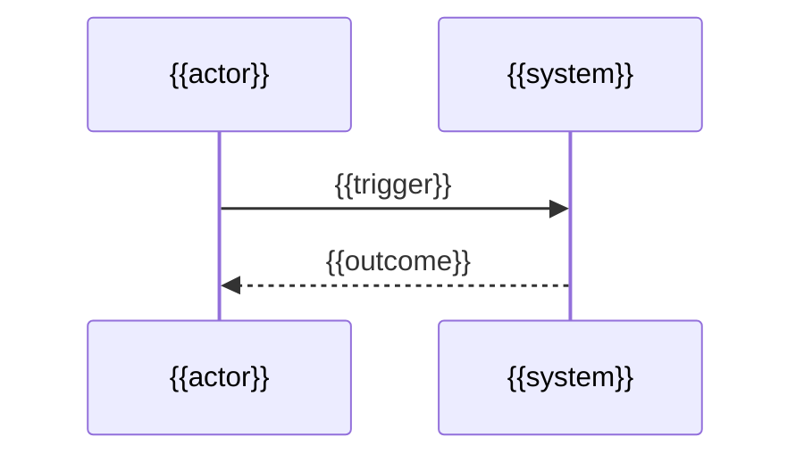

---
docforge_provenance:
  schema: "2.0"
  doc_id: "<DOC_ID>"
  path: "<DOCUMENT_PATH>"
  generated_at: "<GENERATED_AT>"
  generator:
    name: "docforge"
    version: "2.13.1"
  tier: "<TIER>"
  target_depth: "<TARGET_DEPTH>"
  graph:
    provider: "<GRAPH_PROVIDER>"
    flow: "<FLOW_CAPABILITY>"
  sections: []
---
# {{Flow name}}

_Last reviewed: {{YYYY-MM-DD}}_

{{One or two sentences explaining the outcome and who relies on it.}}

## Trigger and actors

**Trigger:** {{event, request, or schedule — name the kind: user action, upstream event/message, scheduled job, or direct call}}

**Preconditions:** {{state, permission, or prior flow that must already hold, or "none"}}

**Actors:** {{human or system participants in business or plain technical language}}

## Happy path

1. {{observable action}}
2. {{observable action}}
3. {{outcome}}

<!-- Default: sequenceDiagram. Switch to a flowchart instead (never both) only when
the reader's primary question is "what are the branches and where do they go" —
see ../../references/illustration.md. -->

## Branches and rules

{{Order branches by how often the trigger actually takes them, most common first.
No branches: state "No branches — every trigger reaches the same outcome" and
delete the block below.}}

### {{Branch name — the condition in plain language}}

**Branches from step:** {{happy-path step number}}

**Condition:** {{the decision, stated as precisely as the code enforces it — never more precisely}}

**Then:** {{what happens instead, or link the owning rule document; never restate a rule owned elsewhere}}

**Rejoins at:** {{a happy-path step, a different outcome, or "ends the flow"}}

{{Repeat this block per branch.}}

**Other rules:** {{A business rule that constrains this flow without creating a branch — one line, linked to its owning document if it governs 3+ flows, or "none beyond the branches above."}}

## Failure and recovery

{{Order failure modes by how often they occur or by blast radius, most severe first.
Evidence only — an error path, retry/backoff config, dead-letter queue, or monitor;
never invent a failure mode.}}

### {{Failure mode — what goes wrong, in plain language}}

**Detected by:** {{exception, timeout, monitor, or check that surfaces it}}

**Immediate response:** {{retry with backoff, idempotent replay, circuit-break, fail fast, or queue for later}}

**State left behind:** {{what is partially applied, queued, or quarantined, and whether repeating the step is safe}}

**Recovery:** {{compensating action, requeue, or manual replay — and what performs it}}

**Escalation boundary:** {{when this hands off to a runbook, operator, or another flow — link it}}

{{Repeat this block per evidenced failure mode.}}

## Outcome

**On success:** {{durable state change, response, or side effect the caller can rely on}}

**On safe failure:** {{what remains guaranteed true even when the flow does not complete}}

**Deferred work:** {{what continues asynchronously after this flow returns, or "none"}}

> **Related:** {{Existing generated documents that own adjacent behavior; delete this footer when none exist.}}
