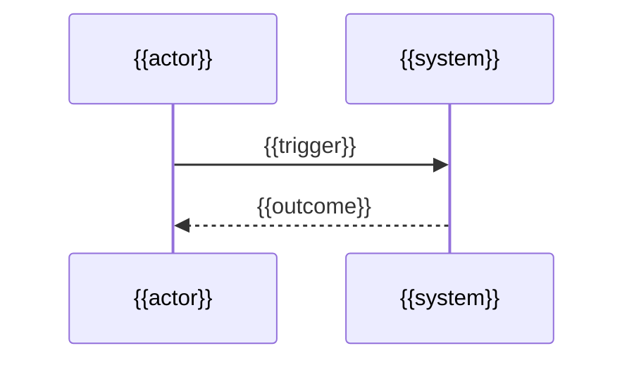

---
docforge_provenance:
  schema: "2.0"
  doc_id: "<DOC_ID>"
  path: "<DOCUMENT_PATH>"
  generated_at: "<GENERATED_AT>"
  generator:
    name: "docforge"
    version: "2.12.0"
  tier: "<TIER>"
  target_depth: "<TARGET_DEPTH>"
  graph:
    provider: "<GRAPH_PROVIDER>"
    flow: "<FLOW_CAPABILITY>"
  sections: []
---
# {{Flow name}}

_Last reviewed: {{YYYY-MM-DD}}_

{{One or two sentences explaining the outcome and who relies on it.}}

## Trigger and actors

**Trigger:** {{event, request, or schedule}}

**Actors:** {{human or system participants in business or plain technical language}}

## Happy path

1. {{observable action}}
2. {{observable action}}
3. {{outcome}}

## Branches and rules

{{Describe only the decisions that change the outcome. Link the owning rule document rather than restating its thresholds.}}

## Failure and recovery

- **{{Failure mode}}.** {{What the system records, retries, requeues, or escalates.}}
- **{{Recovery boundary}}.** {{When another flow, runbook, or operator takes over.}}

## Outcome

{{What success, safe failure, or deferred work means for the caller and the system.}}

> **Related:** {{Existing generated documents that own adjacent behavior; delete this footer when none exist.}}
