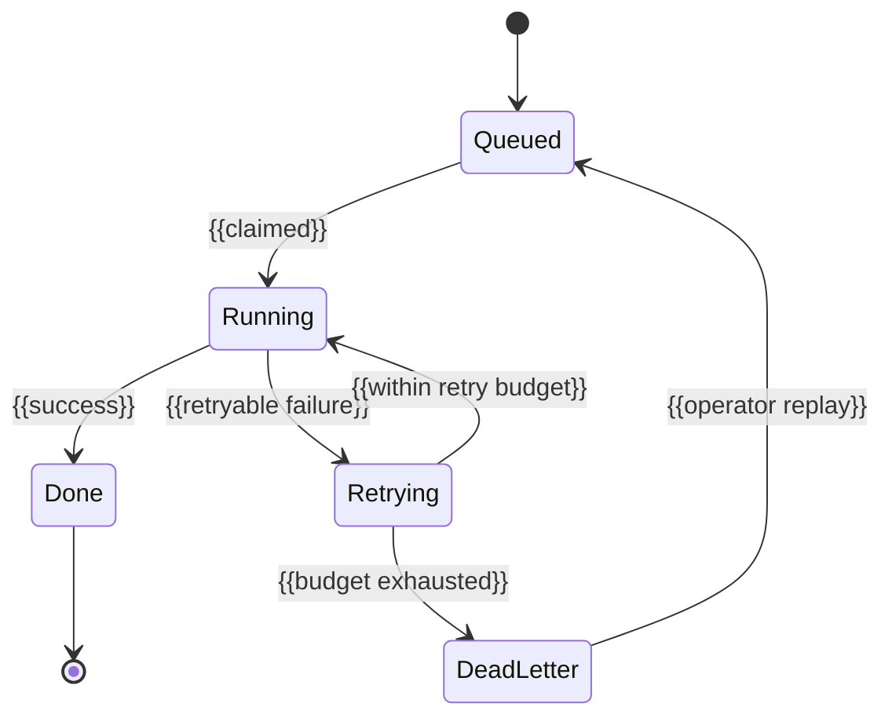

# Job reliability

_Last reviewed: {{YYYY-MM-DD}}_

| Job class | Retry | Idempotency | Timeout | Backpressure | Dead-letter | Replay |
|---|---|---|---|---|---|---|
| {{class}} | {{count + backoff}} | {{mechanism or "none"}} | {{value + on-timeout behavior}} | {{behavior}} | {{destination}} | {{procedure}} |

The table above is the per-class reference; the diagram below answers the
different question a reader has at 3am — where does a failing unit of work end
up, and can it come back?

{{One or two sentences: which state a stuck item actually rests in, what moves
it out, and whether anything is left partially applied on the way. If a claimed
item can never be reclaimed, say so here — that is the failure operators hit.}}

Job identity and triggers: see
[triggers-and-jobs.md](triggers-and-jobs.md).
