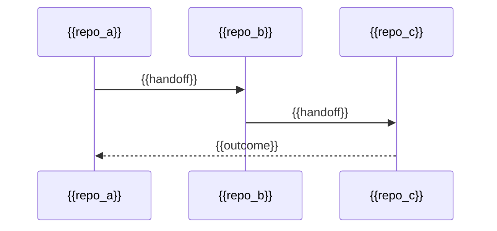

---
docforge_provenance:
  schema: "2.1"
  doc_id: "<DOC_ID>"
  path: "<DOCUMENT_PATH>"
  generated_at: "<GENERATED_AT>"
  generator:
    name: "docforge"
    version: "2.16.0"
  tier: "<TIER>"
  target_depth: "<TARGET_DEPTH>"
  graph:
    provider: "<GRAPH_PROVIDER>"
    flow: "<FLOW_CAPABILITY>"
  sections: []
---
# {{Epic title}}

_Last reviewed: {{YYYY-MM-DD}}_

## Outcome

{{What this cross-repo initiative delivers when done.}}

## Member repos

| Repo | Owning flow / feature | Component touched |
|---|---|---|
| {{repo}} | {{flow or feature link}} | {{component}} |

## Cross-repo sequence

## Open gaps

| Gap | Why it matters | Owner token |
|---|---|---|
| {{gap}} | {{impact}} | {{owner}} |
