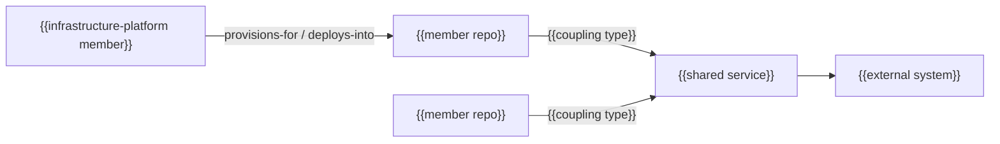

---
docforge_provenance:
  schema: "2.0"
  doc_id: "<DOC_ID>"
  path: "<DOCUMENT_PATH>"
  generated_at: "<GENERATED_AT>"
  generator:
    name: "docforge"
    version: "2.8.0"
  tier: "<TIER>"
  target_depth: "<TARGET_DEPTH>"
  graph:
    provider: "<GRAPH_PROVIDER>"
    flow: "<FLOW_CAPABILITY>"
  sections: []
---
# System context

_Last reviewed: {{YYYY-MM-DD}}_

{{One paragraph: what the portfolio borders and how members relate.}}

## Cross-repo flows

| Trigger | Repos involved | Outcome | Owning flow |
|---|---|---|---|
| {{trigger}} | {{repos}} | {{outcome}} | {{link to owning repo's flow doc}} |

## Dependency edges

| Repo | Depends on | Coupling type | Resolution |
|---|---|---|---|
| {{repo}} | {{sibling repo}} | {{shared library / API contract / event schema / provisions-for / deploys-into}} | {{mapping / heuristic}} |
