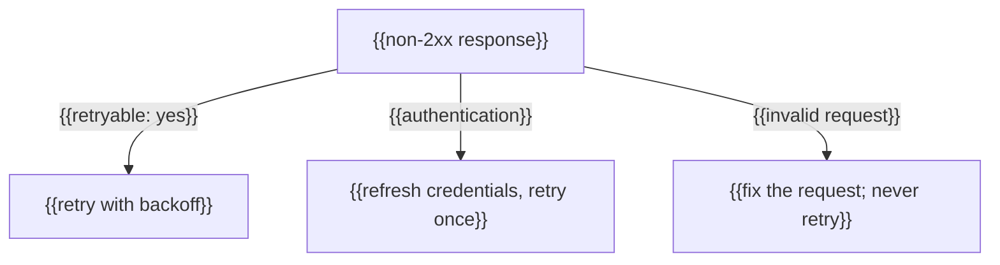

# Errors

_Last reviewed: {{YYYY-MM-DD}}_

## Error response shape

Every error returns the same envelope. New fields may be added; existing fields
never change meaning.

| Field | Type | Description |
|---|---|---|
| `type` | string | Category: `invalid_request`, `authentication`, `permission`, `rate_limit`, `api_error` |
| `code` | string | Stable machine-readable identifier — branch on this, not on `message` |
| `message` | string | Human-readable; may change between releases |
| `param` | string? | The field at fault, where applicable |
| `request_id` | string | Include this when contacting support |
| `doc_url` | string | Link to the catalog entry below |

```json
{
  "error": {
    "type": "invalid_request",
    "code": "resource_not_found",
    "message": "No {{resource}} found with id 'abc'.",
    "param": "id",
    "request_id": "req_{{...}}",
    "doc_url": "{{...}}#resource_not_found"
  }
}
```

## Status codes

| Status | Meaning | Retryable |
|---|---|---|
| 400 | Malformed or invalid request | no |
| 401 | Missing or invalid credentials | no |
| 403 | Authenticated but not permitted | no |
| 404 | Resource does not exist or is not visible to the caller | no |
| 409 | Conflicts with current state | after resolving |
| 422 | Well-formed but semantically invalid | no |
| 429 | Rate limit exceeded | yes, after `Retry-After` |
| 5xx | Server-side fault | yes, with backoff |

The table is the lookup; the diagram answers the caller's actual question — what
should my client *do* with this response?



{{One or two sentences: which class is safe to retry blindly, which needs a
fresh credential first, and which will never succeed on retry no matter the
backoff.}}

## Catalog

### `{{error_code}}`

**Status:** {{4xx}} · **Type:** `{{type}}`

**Message:** "{{template}}"

**Cause:** {{why this happens}}

**Resolution:** {{what the caller should do}}

**Retryable:** {{yes/no — and under what conditions}}
