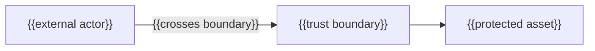

---
docforge_provenance:
  schema: "2.1"
  doc_id: "<DOC_ID>"
  path: "<DOCUMENT_PATH>"
  generated_at: "<GENERATED_AT>"
  generator:
    name: "docforge"
    version: "2.16.0"
  tier: "<TIER>"
  target_depth: "<TARGET_DEPTH>"
  graph:
    provider: "<GRAPH_PROVIDER>"
    flow: "<FLOW_CAPABILITY>"
  sections: []
---
# Threat model

_Last reviewed: {{YYYY-MM-DD}}_

## Assets and trust boundaries

{{What each boundary separates, and why the asset behind it matters.}}

## STRIDE applicability

| DFD element type | S | T | R | I | D | E |
|---|---|---|---|---|---|---|
| External entity | ✓ | N/A | ✓ | N/A | N/A | N/A |
| Process | ✓ | ✓ | ✓ | ✓ | ✓ | ✓ |
| Data store | N/A | ✓ | ✓ | ✓ | ✓ | N/A |
| Data flow | N/A | ✓ | N/A | ✓ | ✓ | N/A |

## STRIDE matrix

Use `N/A`, `examined-none-found`, or a threat ID in every applicable cell.

| Element | Type | S | T | R | I | D | E |
|---|---|---|---|---|---|---|---|
| {{element}} | {{entity/process/store/flow}} | {{value}} | {{value}} | {{value}} | {{value}} | {{value}} | {{value}} |

## Threat details

### {{Asset or boundary}} — {{STRIDE category}}

**Threat:** {{what an attacker could do here}}

**Disposition:** {{mitigate | eliminate | transfer | accept}} — {{the testable control and safe evidence}}

**Residual uncertainty:** {{what remains, or why evidence is incomplete}}

## Accepted residual risk

{{List accepted risks only with rationale, review condition, established owner, and
decision link. `None accepted based on available evidence` is valid.}}

Data classifications: see [data-handling.md](data-handling.md). Disclosure
process: see [security-policy.md](security-policy.md).
