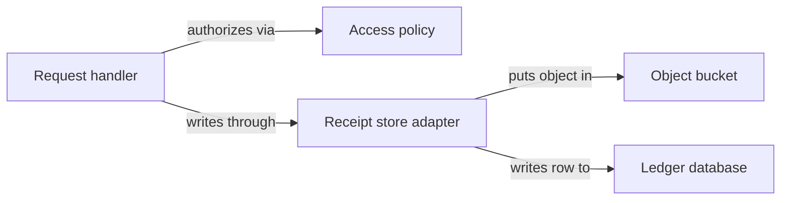
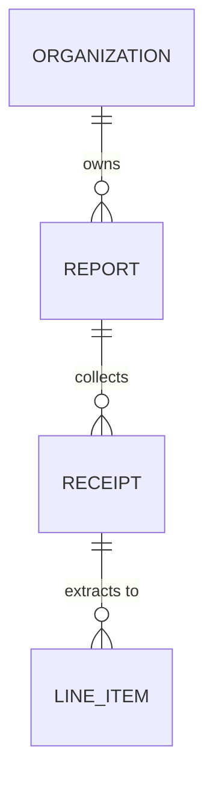

<!-- CRAFT REFERENCE, NOT A GENERATED ARTIFACT.

A worked `architecture-low-level` document for the same fictional expense
service as the flow exemplars, showing what the standard-layout template
produces when it is filled well. Read it beside
../../architecture/templates/architecture-low-level.md and the
"Low-level architecture writing craft" section of
../../architecture/instructions.md; update it in the same change as either
of them.

Where a real document would link a neighbouring document with a relative path,
this file names the neighbour in bold instead, so it stays self-contained and
passes lint on its own. -->

# Low-level architecture

_Last reviewed: 2026-08-18_

<!-- L0 -->

Component-level decomposition. Zooms into the blocks named in the high-level
architecture. It never becomes a Level-4 code or class document.

**This decomposition exists to support:** deciding where a new receipt source
belongs, diagnosing a receipt that never reached an approver, and judging
whether a change to extraction can be made without touching the approval path.

## Layout

<!-- L1 -->

```text docforge-role=structure
ledger/
├── api/          synchronous HTTP surface; owns authorization and the receipt row
├── workers/      queue consumers; extraction and notification
├── domain/       receipt and report state machines, shared by api and workers
├── storage/      bucket and database adapters; no business rules
└── tests/        contract tests per adapter, state-machine tests per transition
```

The grouping is by runtime role, not by feature: a change to what a receipt
means touches `domain/` alone, while a change to where images live touches
`storage/` alone. A feature-shaped layout would have put both in a `receipts/`
folder and lost that separation.

## Selected whiteboxes

<!-- L1 — every block worth decomposing is named here; each is explained below. -->

### Expense API

**Motivation for decomposition:** this block holds the only synchronous path a
user waits on, and the only place authorization is enforced. A reviewer asking
"can this request be slow, and who checked permissions" needs its internals.

**Allowed dependency direction:** the API depends on `domain/` and `storage/`;
neither depends back. A state transition that needs an HTTP concept is a signal
the transition belongs in the API, not in the domain.



The handler never reaches the bucket or the database directly, which is what
lets the store adapter keep the object write and the row write in a fixed order.
The direction the block forbids is the useful one to state: the access policy
never calls the store, so no permission decision can depend on data the request
has already written.

## Components

<!-- L2 -->

### Request handler

**Responsibility:** terminates the HTTP request, validates its shape, and
sequences the calls that satisfy it. It owns the boundary between an untrusted
request and a domain operation.

**Technology:** the service's HTTP framework; no persistence of its own.

**Public contract:** `POST /v1/receipts`, `POST /v1/reports/{id}/approve`

- **Talks to:** -> Access policy — asks for a decision before any write
- **Talks to:** -> Receipt store adapter — writes the object and the row
- **Owns:** request validation and the mapping from a domain error to a status
  code
- **Invariant:** never writes through two adapters in one request, so no request
  can leave a partial write behind that the adapter cannot undo
- **Failure boundary:** converts every domain error into a status code; an
  adapter exception that reaches it becomes a `500` and is never retried here,
  because the client owns the retry
- **Key paths:** `api/handlers/`, `api/errors.py`

### Access policy

**Responsibility:** decides whether an actor may act on a report, and owns the
organization-membership rule.

**Technology:** plain domain code; no external calls.

**Public contract:** `may_submit(actor, report)`, `may_approve(actor, report)`

- **Talks to:** nothing — it is a pure function over the actor and the report
- **Owns:** the distinction between filing against a report and approving one
- **Invariant:** an approver is never the report's owner; this is enforced here
  and nowhere else, so a second approval path would silently lose it
- **Failure boundary:** returns a decision, never raises; an unknown actor is a
  denial rather than an error
- **Key paths:** `domain/policy.py`

### Receipt store adapter

**Responsibility:** writes the image and the receipt row in a fixed order, and
is the only component that knows both the bucket and the database.

**Technology:** the object-store SDK and the database driver.

**Public contract:** `put_receipt(image, report_id) -> ReceiptId`

- **Talks to:** -> Object bucket — puts the object under its content hash
- **Talks to:** -> Ledger database — writes the receipt row
- **Owns:** the content-hash key derivation and the object-before-row ordering
- **Invariant:** the row is never written before the object, so a row always has
  an image; the reverse leaves an orphan the bucket lifecycle rule collects,
  which is the cheaper of the two failures
- **Failure boundary:** a bucket failure raises before any row exists; a database
  failure leaves the orphaned object and raises. It never attempts compensation
- **Key paths:** `storage/receipts.py`

## Runtime scenario

<!-- L2 — chosen as an error scenario, the fourth arc42 area. -->

### A receipt write that fails after the object is stored

This is the path a reviewer asks about first, because it is the one that leaves
state behind. It succeeds by leaving an image with no row — recoverable and
cheap — rather than a row with no image.

```mermaid
sequenceDiagram
  accTitle:Runtime scenario — receipt write failing after the object is stored
  accDescr: The handler calls the store adapter, which puts the object and then writes the row; on a database failure the adapter raises and the object is left for lifecycle collection.
  participant Handler as Request handler
  participant Adapter as Receipt store adapter
  participant Bucket as Object bucket
  participant Ledger as Ledger database
  Handler->>Adapter: put_receipt(image, report)
  Adapter->>Bucket: put object under content hash
  Bucket-->>Adapter: object key
  Adapter->>Ledger: write receipt row
  Ledger-->>Adapter: constraint violation
  Adapter-->>Handler: raises; object left orphaned
```

The adapter puts the object before it writes the row, so this failure leaves an
image nobody references. Nothing compensates for it in the request path; the
bucket lifecycle rule collects it, and the handler turns the exception into a
status code the client can retry safely because the key is content-addressed.
The success path is the same sequence with the row write returning a receipt id
instead of a violation — worth stating in this sentence rather than drawing,
since the two paths differ in one message.

## Quality and change scenarios

The extraction queue is sized for a burst of 2,000 receipts within one hour, the
volume the month-end close produced last quarter; the worker count is configured
against that figure rather than against steady-state load.

Adding a second receipt source — an email intake alongside the HTTP one — was
anticipated: the store adapter takes an image and a report id rather than a
request, so a new source is a new caller of the same adapter and touches neither
`domain/` nor the extraction worker.

## Data model

The durable model is small and deliberately denormalized in one place: a line
item carries its own amount rather than referencing a catalog, so a change to
expense categories cannot alter an already-approved total.



The write path runs one way down this diagram: only extraction creates line
items, and only approval writes the report's terminal state. A component that
needed to write in the other direction would be crossing the boundary the
whitebox above forbids.

## Significant subsystems

The ones worth a full deep-dive get their own concept document:

| Subsystem | Deep-dive |
|---|---|
| Receipt state machine | the receipt concept document |
| Report state machine | the report concept document |

## Cross-cutting concerns

| Concern | Where it lives | Notes |
|---|---|---|
| Configuration | `config/` | environment-injected; no defaults in code |
| Error handling | `api/errors.py` | domain errors map to status codes in one table |
| Logging | `storage/`, `workers/` | structured; the API layer logs nothing of its own |
| Authentication | no evidenced path found | terminated upstream of this service; the graph shows no verification here |
| Persistence | `storage/` | the only components that hold a driver |

Authentication is stated rather than omitted on purpose: a missing row would
read as "handled somewhere", and the evidence does not support that.
