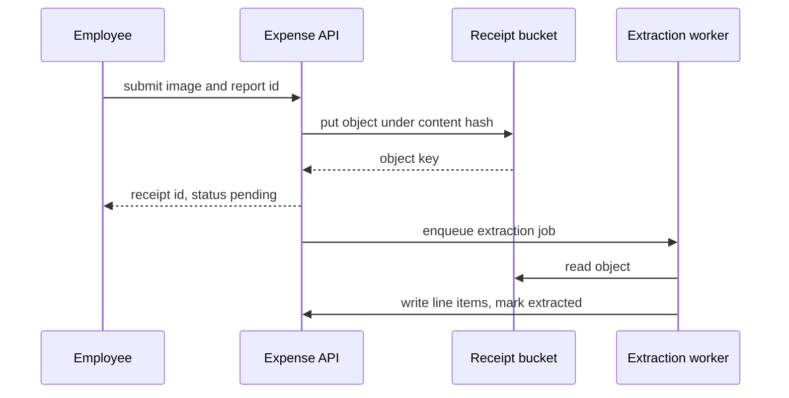
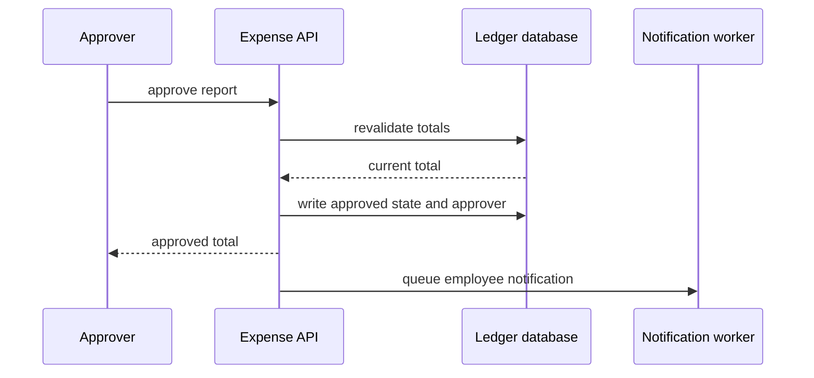

<!-- CRAFT REFERENCE, NOT A GENERATED ARTIFACT.

The compact-layout counterpart of flow.standard.example.md: the same fictional
expense service, the same first flow, folded into `docs/flows.md`. Read the two
side by side — every field of the standard document appears here, each repeated
block collapsed to one line per instance. Nothing was summarized away.

Read it beside ../../compact/templates/flows.template.md and the "Writing
docs/flows.md" section of ../../compact/instructions.md; update it in the same
change as either of them.

Where a real document would link a neighbour with a relative path, this file
names the neighbour in bold instead, so it stays self-contained and lintable. -->

# Flows

_Last reviewed: 2026-08-18_

This service turns expense receipts into reviewable, reimbursable ledger
entries. Work enters through one of three doors — an employee filing a receipt,
an approver acting on a report, and a nightly export to the accounting system —
and a reader new to the project should start with submitting a receipt, because
everything downstream reads what it writes.

## At a glance

Every flow moves a receipt or a report between states, and the two state
machines are the spine of the system. Submission and extraction populate a
report; approval closes it; export drains it. Nothing writes a line item except
extraction, and nothing closes a report except approval — a reader tracing an
unexpected value can start from whichever of those two owns the field.

## Scope and boundaries

This section owns what happens in order, and who is waiting on each step. The
shape of the components those steps run in is owned by the architecture section;
the meaning of a receipt or a report as domain terms is owned by the concepts
section. Two candidates are known but not expanded here, and stay as matrix rows.

## Flow candidate matrix

| Flow | Entry reference | Area | Confidence | Reach | Priority | Status |
|---|---|---|---|---|---|---|
| [Submit an expense receipt](#submit-an-expense-receipt) | `POST /v1/receipts` | receipts | confirmed | 8 steps / 4 boundaries | main | documented below |
| [Approve a report](#approve-a-report) | `POST /v1/reports/{id}/approve` | approvals | confirmed | 5 steps / 2 boundaries | main | documented below |
| Export approved reports | `cron: nightly-export` | accounting | confirmed | 6 steps / 3 boundaries | deferred | matrix only |
| Reopen a submitted report | `POST /v1/reports/{id}/reopen` | approvals | candidate | 3 steps / 1 boundary | deferred | matrix only |

Every evidenced candidate appears above whether or not it has a section below.
A `matrix only` row means the candidate is real and located in the code, and
that it has not been analyzed here — it is never a flow that was ruled out.

## Submit an expense receipt

**Guarantee:** a receipt that reaches `stored` is durable and will be extracted
exactly once, even if extraction fails repeatedly; a receipt that never reaches
`stored` leaves no row behind.

**Trigger:** user action — an authenticated `POST /v1/receipts` carrying the
image and a target report id · **Initiated by:** the employee who incurred the
expense · **Preconditions:** the report exists and is open.

**Actors:** the expense API answers the employee synchronously; the receipt
bucket, the extraction worker, and the ledger database work behind it, and the
client polls the receipt id for status.

**Data in play:** reads the report's state and the employee's organization
membership; writes one receipt row, one bucket object, and one line item per
extracted amount.

**Timing and limits:** images above 10 MB are rejected at the edge; extraction
retries three times with exponential backoff, then dead-letters; a receipt still
`pending` after 30 minutes is swept by the reconciliation job.

**Happy path:**

1. The employee submits the image and the target report id.
2. The expense API authorizes the employee against the report's organization.
3. The API writes the image to the receipt bucket under a content-addressed key.
4. The API records a receipt row in state `stored` and returns its id.
5. The API enqueues an extraction job carrying the receipt id.
6. The extraction worker reads the object and calls the OCR provider.
7. The worker writes one line item per recognized amount and moves the receipt
   to `extracted`.
8. The report's pending total is recalculated and the receipt becomes visible to
   the approver.

Step 4 is the durability boundary: everything before it is discarded on failure,
everything after it is retried.

**Branches:** a content hash already on the same report returns the existing
receipt id with `201` and ends the flow, so a client retrying a timed-out
request is safe · the report closing between authorization and write rejects
the write at step 4 and leaves the object orphaned for the bucket lifecycle rule.

**Rules:** an employee may file against any open report in their organization,
not only their own — ownership is enforced at approval, and that rule is owned
by the approval flow below.

**Failures:** awaited external event — the OCR provider returns no usable
amounts; detected by the worker's schema check, retried three times, then
dead-lettered and flagged for manual entry, with the receipt left `stored` and
its image intact · timeout — extraction never finishes; detected by the
reconciliation sweep after 30 minutes, re-enqueued once, then flagged rather
than swept a third time · system-wide cancellation — the report is cancelled
mid-extraction; detected by the worker's state check before writing, which stops
without writing, so no partial line items exist.

**Observability:** a `receipt.extracted` counter tagged with the outcome, and
the sweep count from the reconciliation job. A sweep count approaching the
extraction count means the queue is not draining — the earliest visible symptom
of an OCR outage. Dead-letter depth is the paging signal.

**Outcome:** on success, one `extracted` receipt with one line item per
recognized amount, visible to the approver; on safe failure, the guarantee still
holds — never lost, never extracted twice; deferred, the report's pending total
recalculates asynchronously, so an approver may briefly see the receipt before
the total updates.

## Approve a report

**Guarantee:** an approved report is immutable and carries the identity of the
approver; a report that fails approval is left open and unchanged.

**Trigger:** user action — `POST /v1/reports/{id}/approve` · **Initiated by:**
an approver in the report owner's organization · **Preconditions:** the report
is `submitted` and every receipt on it has left `stored`.

**Actors:** the expense API answers the approver synchronously; the ledger
database and the notification worker work behind it.

**Data in play:** reads every line item on the report; writes the report's
state, the approver identity, and the approved total.

**Timing and limits:** approval is a single transaction with no retry; the
notification is queued and retried five times.

**Happy path:**

1. The approver calls approve on a submitted report.
2. The API revalidates the report total against the current line items.
3. The API writes the approved state, the approver identity, and the total.
4. The API returns the approved total.
5. A notification to the employee is queued.

**Branches:** a total that no longer matches the one shown to the approver
rejects the call and returns the current figure, so approval is never applied to
a stale view; the report stays `submitted` and the approver can retry.

**Rules:** an approver may not approve their own report — this is the ownership
rule the submission flow defers to.

**Failures:** decision point — the revalidated total differs from the submitted
one; detected in step 2, rejected before any write, leaving the report open ·
awaited external event — the notification is never delivered; detected by the
notifier's retry exhaustion, which leaves the approval intact because delivery
is not part of the approval transaction.

**Observability:** an `approval.rejected` counter tagged with the reason. A
sustained rise in stale-total rejections means extraction is landing after
submission, which is a receipts-side problem rather than an approvals one.

**Outcome:** on success, an immutable report carrying its approver and total; on
safe failure, the report is untouched and can be approved again; deferred, the
employee notification.
