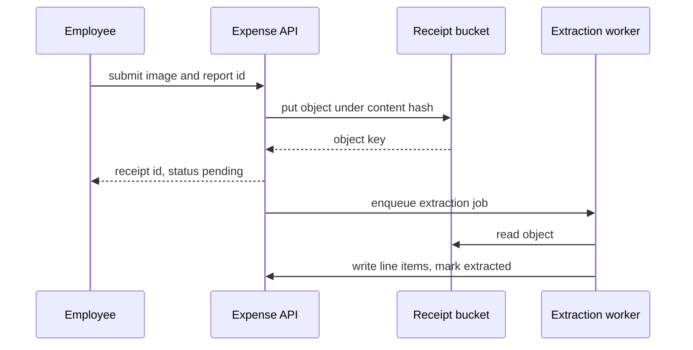

<!-- CRAFT REFERENCE, NOT A GENERATED ARTIFACT.

A worked `flow` document for a fictional expense service, showing what the
standard-layout template produces when it is filled well. Read it beside
../../flows/flow.template.md and ../../flows/instructions.md; update it in the
same change as either of them.

Where a real document would link a neighbouring document with a relative path,
this file names the neighbour in bold instead, so it stays self-contained and
passes lint on its own. The one exception is the link to the architecture
exemplar, which demonstrates the real form.

Levels are annotated in comments. A generated document carries the comments;
it never renders the labels. -->

# Submit an expense receipt

_Last reviewed: 2026-08-18_

<!-- L0 -->

An employee photographs a receipt and files it against an open expense report.
The flow converts the image into line items an approver can review, and it is
the only path by which a receipt enters the ledger — the reimbursement and
audit-export flows both read what this one writes.

**Guarantee:** a receipt that reaches `stored` is durable and will be extracted
exactly once, even if extraction fails repeatedly; a receipt that never reaches
`stored` leaves no row behind.

## Trigger and actors

<!-- L1 -->

**Trigger:** user action — an authenticated `POST /v1/receipts` carrying the
image and a target report id.

**Preconditions:** the report exists and is open; a submitted or approved report
rejects new receipts.

**Initiated by:** the employee who incurred the expense, through the mobile or
web client.

**Visible participants:** the expense API, which answers synchronously with the
receipt id and a `pending` status.

**Behind the scenes:** the object store that holds the image, the extraction
worker that reads the queue, and the ledger database that records line items.
The employee sees none of these; the client polls the receipt id for status.

**Data in play:** reads the report's state and the employee's organization
membership; writes one receipt row, one object in the receipt bucket, and one
line-item row per extracted amount.

**Timing and limits:** images above 10 MB are rejected at the edge; extraction
is retried three times with exponential backoff, then dead-lettered; a receipt
that has not left `pending` after 30 minutes is swept by the reconciliation job.

## Happy path

<!-- L1 — steps are named here; what can go wrong is below. -->

### Accepting the image

1. The employee submits the image and the target report id.
2. The expense API authorizes the employee against the report's organization.
3. The API writes the image to the receipt bucket under a content-addressed key.
4. The API records a receipt row in state `stored` and returns its id.

### Extracting the line items

5. The API enqueues an extraction job carrying the receipt id.
6. The extraction worker reads the object and calls the OCR provider.
7. The worker writes one line item per amount it recognizes and moves the
   receipt to `extracted`.
8. The report's pending total is recalculated and the receipt becomes visible to
   the approver.

The two milestones are not cosmetic: everything before step 4 is discarded on
failure, and everything after it is retried. A reader deciding whether a lost
receipt is recoverable needs only to know which side of step 4 it reached.



## Branches and rules

<!-- L2 -->

### The image duplicates a receipt already on this report

**Branches from step:** 3

**Condition:** the content hash already exists on the same report. The check is
per report, not per organization — the same receipt filed against two different
reports is two receipts, and the code does not treat that as duplication.

**Then:** the API returns the existing receipt id with `201` rather than
creating a second row, so a client retrying a timed-out request is safe.

**Rejoins at:** ends the flow — the original receipt keeps whatever state it had.

### The report closes between authorization and write

**Branches from step:** 4

**Condition:** the report moved to `submitted` after step 2 passed.

**Then:** the write is rejected and the stored object is left orphaned for the
bucket lifecycle rule to collect. The employee is told the report is closed.

**Rejoins at:** ends the flow.

**Other rules:** an employee may file against any open report in their
organization, not only their own — the ownership rule is enforced at approval,
not at submission, and is owned by the approval flow rather than restated here.

## Failure and recovery

<!-- L2 — most consequential first. -->

### The OCR provider returns nothing usable

**Category:** awaited external event

**Detected by:** the worker's schema check on the provider response; a response
with zero amounts is treated as a failure, not as an empty result.

**Immediate response:** retry with exponential backoff, three attempts.

**State left behind:** the receipt stays `stored` with no line items. The image
is intact and the row is complete; only extraction is missing.

**Recovery:** after the third attempt the job moves to the dead-letter queue and
the receipt is flagged for manual entry, which an approver can complete in place.

**Escalation boundary:** dead-letter depth is the operations runbook's signal,
not this flow's — the flow's responsibility ends when the receipt is flagged.

### Extraction never finishes

**Category:** timeout

**Detected by:** the reconciliation job, which sweeps receipts that have been
`stored` for more than 30 minutes with no terminal state.

**Immediate response:** the job re-enqueues the extraction once and records the
sweep on the receipt.

**State left behind:** unchanged — the sweep is idempotent because line items are
keyed by receipt id and amount position.

**Recovery:** a receipt swept twice is flagged for manual entry rather than
re-enqueued a third time.

**Escalation boundary:** hands off to the operations runbook once the sweep rate
exceeds its threshold.

### The employee cancels the report mid-extraction

**Category:** system-wide cancellation

**Detected by:** the worker's state check before it writes line items.

**Immediate response:** the worker stops and does not write.

**State left behind:** the receipt keeps its object and its `stored` state; no
partial line items exist, because the write is a single transaction.

**Recovery:** none is needed — reopening the report re-enqueues extraction for
every receipt still in `stored`.

**Escalation boundary:** none; this path is fully automatic.

## Observability

Each extraction emits a `receipt.extracted` counter tagged with the outcome, and
the reconciliation job emits the number of receipts it swept. A healthy hour
shows sweeps in the low single digits; a sweep count approaching the extraction
count means the queue is not draining, which is the earliest visible symptom of
an OCR outage. The dead-letter queue depth is the paging signal.

## Outcome

<!-- L3 -->

**On success:** one receipt row in `extracted`, one object in the bucket, and
one line item per recognized amount, all visible to the approver.

**On safe failure:** the guarantee above still holds — a receipt that reached
`stored` is never lost and never extracted twice, whatever happens afterwards.

**Deferred work:** the report's pending total is recalculated asynchronously,
so an approver opening the report immediately may see the receipt before the
total updates.

```text
receipt submitted
├─ new image ────────> stored ──> extracted ──> visible to approver
├─ duplicate hash ───> existing receipt returned unchanged
└─ report closed ────> rejected, object orphaned for lifecycle collection
```

A single submission fans out to these three terminal outcomes and nothing
branches further.

## Why it works this way

Content-addressed keys were adopted when duplicate submissions from mobile
retries were filling the bucket; the decision record for the retry contract
covers the alternatives that were weighed.

> **Related:** the approval flow owns what happens to an extracted receipt; the
> [architecture exemplar](architecture.standard.example.md) owns the components
> named here.
