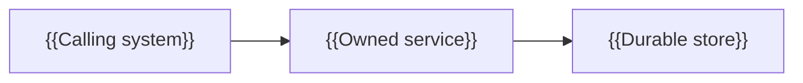

# Illustration

This reference owns visual form selection and illustration constraints. An
illustration compresses evidence; it never replaces the evidence-backed prose.
Every visual must be introduced or followed by prose that explains its point,
important relationships, and any exception a reader must understand. This is
required for accessibility and for readers whose renderer does not support the
visual.

## Choose the smallest useful form

- Use prose when fewer than three elements or steps are involved.
- Use a Markdown table for enumerable facts with stable, repeated fields.
- Use an ASCII `text` fence for directory trees, layered stacks, record
  layouts, and timelines.
- Use an ASCII `text` fence for a short linear flow (at most four steps, no
  branch) when the reader's question is only what happens, in order, and a
  full diagram would add chrome without adding information; promote to
  Mermaid once a branch appears.
- Use a Mermaid `flowchart` for branching choices or relationship maps.
- Use a Mermaid `sequenceDiagram` when order across actors or systems matters.
- Use a Mermaid `journey` when the reader's question is how effort or
  satisfaction changes across an end-to-end process for one actor, not just
  the order of steps.
- Use a Mermaid `timeline` when the reader's question is what happened, or
  will happen, in calendar order, not in step or actor order.
- Use a Mermaid `stateDiagram-v2` for lifecycle states and transitions.
- Use a Mermaid `erDiagram` for durable data relationships.

Do not turn a list into a diagram merely for decoration. If two forms could
work, choose the one that answers the reader's question with fewer elements.

## Complexity budgets

The depth vocabulary is defined in
[`depth-and-audience.md`](depth-and-audience.md): Orientation, Working depth,
Deep dive, Reference, and Router. Catalog machine values include `orientation`,
`deep-dive`, `reference`, and `router`; do not invent `target_depth: working`.
Apply the Working depth budget to content whose purpose is ordered behavior,
important rules, inputs/outputs, and common failures.

The budget bounds a single illustration. **There is no cap on how many
illustrations a document may carry.** Every illustration must earn its place
under "Choose the smallest useful form" above, and that relevance test is the
only thing that limits the count. A document needing six diagrams to answer
six distinct reader questions should carry six.

| Depth | Bound per illustration |
|---|---|
| Orientation (`orientation`) | At most 5 meaningful elements |
| Working depth | At most 8 meaningful elements |
| Deep dive (`deep-dive`) | At most 12 meaningful elements |
| Reference (`reference`) | At most 12 meaningful elements |
| Router (`router`) | At most 12 meaningful elements |

Reference documents normally use tables; reach for a relationship illustration
when lookup fields cannot express the relationship clearly. Router documents
normally use prose and links, because their reader wants a destination rather
than a picture. Both are form preferences, not quotas.

Split any illustration that exceeds its bound into linked views with one stated
question each. **Splitting is always available** — the resulting views are
additional illustrations, and that is the intended outcome, not a violation.
Before splitting, check whether the content is actually enumerable,
independent, stable-field data — a roster of named items with repeated
attributes and no real sequence or branching between them — rather than a flow
or relationship; that shape belongs in a table instead.

A sequence diagram also has at most 5 participants; a state diagram at most 8
named states; an ER diagram at most 8 entities; a journey diagram at most 4
sections.

## Mermaid constraints

- Use identifiers without spaces, such as `PaymentService`.
- Quote labels containing punctuation, spaces, or placeholder braces.
- Do not use the reserved identifiers `end`, `graph`, or `subgraph`, including
  as differently cased stand-alone IDs.
- Do not use `style`, `classDef`, colors, themes, or `click` directives.
- Keep direction and zoom consistent. Prefer `LR` for peer relationships and
  `TD` for ordered branching.
- Keep labels short and explain detail in the surrounding prose.
- Every meaningful relationship is directional and carries a specific active
  verb; include a protocol or channel when evidence establishes one.
- Prefer a second complementary form answering a different reader question to
  enlarging a diagram. Never use deprecated `stateDiagram` syntax.

Use stable semantic IDs even when the visible label is reader-facing:



The prose around this scaffold must say what crosses each boundary and why the
relationship matters.

## ASCII constraints

Use a fenced `text` block, align content with spaces, and keep every line at or
below 100 characters. Use only these structural glyphs:

- trees: `│`, `├`, `└`, `─`;
- boxes and layered stacks: `┌`, `┐`, `└`, `┘`, `─`, `│`, `├`, `┤`, `┬`, `┴`;
- timelines and arrows: `─`, `│`, `├`, `└`, `>`.

Do not mix Unicode and ASCII substitutes for the same connector. Check the
rendered alignment in a monospace font. Labels may use ordinary text, but
connectors must come from the fixed set above.

```text
{{repository}}/
├── {{source directory}}/    {{one-line responsibility}}
└── {{test directory}}/      {{one-line responsibility}}
```

Follow the fence with a sentence explaining what the grouping reveals; do not
assume indentation alone communicates ownership or runtime boundaries.

```text
{{trigger event}}
├─ {{condition A}} ──> {{step}} ──> {{outcome A}}
└─ {{condition B}} ──> {{step}} ──> {{outcome B}}
```

Follow the fence with a sentence stating that a single trigger fans out to
these outcomes and nothing branches further; a second-level branch, or a step
that needs to name which actor performs it, is the signal to promote to a
Mermaid flowchart or sequenceDiagram instead.
